# Sheets

Generated by build.py from beehut/sheets/; do not edit. Dimensions in inches, heights above the deck.

## 1. Plan

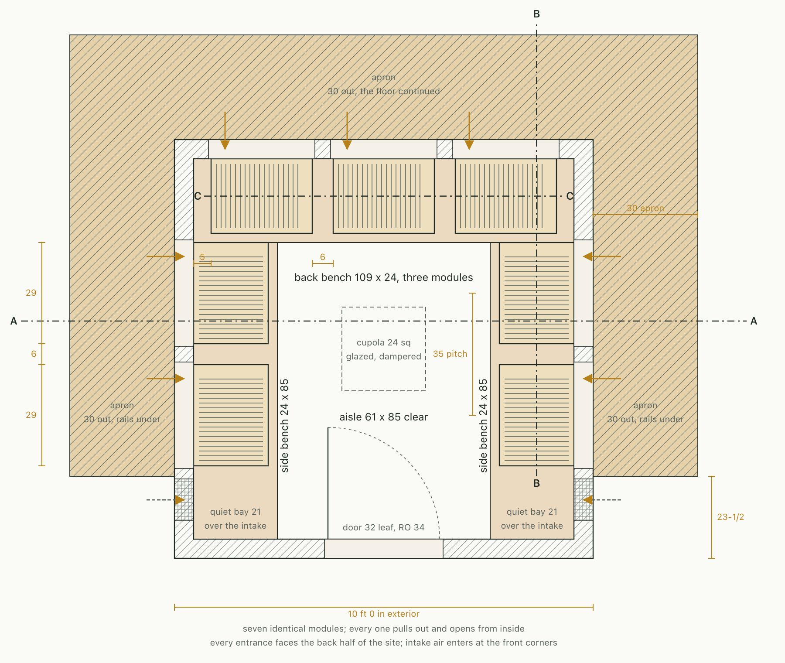

Skid-built 120 in square, 5-1/2 in walls, 109 in clear inside. Seven identical modules on a 35 in pitch: two at the rear of each side bench (the rear one ending at the back bench, 6 in between them) and three centred on the back wall, 6 in apart and 5 in from each corner. Each pulls out through a 30-1/2 in rough opening onto the 30 in apron; entrances at the rear edge of every face. A 21 in quiet bay at the front of each side bench sits over the 12 in intake, 5-1/4 in from the front corner. Door 32 in leaf in a 34 in opening, 24 in glazed cupola over the centre of the aisle.

## 2. Section A-A

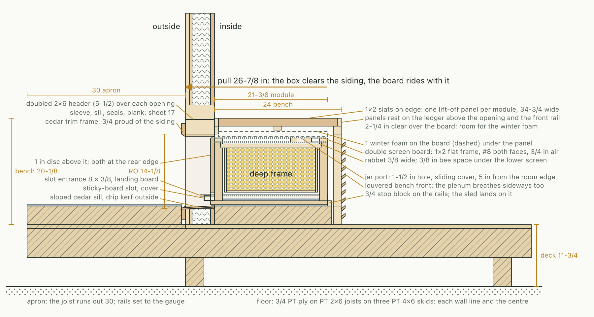

Across a side bench through a module, looking along the wall. The module (21-3/8 deep, 12-5/8 tall with its sled and double screen board) rides on two PT 2×4 rails with UHMW tops, 3-3/4 above the deck, and passes through the hatch cartridge in a 30-1/2 × 14-1/8 rough opening whose sill is 3 above the deck. The bench is a separate structure: a 1×2 ledger on the wall above the opening and a louvered 2×4 front rail carry lift-off ladder panels, 2-1/4 in clear over the board, bench top 20-1/8 above the deck. Pull the module 26-7/8 in onto the apron outside for an inspection; feeding is with the panel off, since no jar fits under it. Deck 11-3/4 above grade on PT 4×6 skids.

## 3. Stack detail

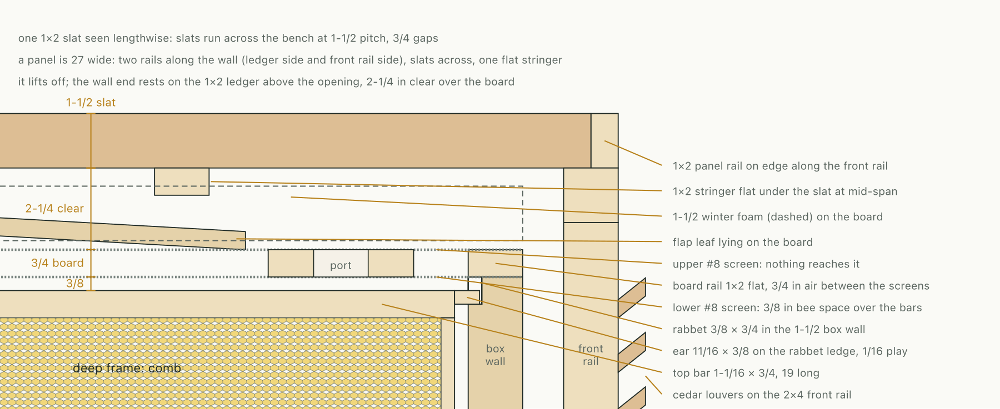

The top corner of a module at the room end, from Section A-A at large scale. The frame ear (11/16 × 3/8) sits on the rabbet ledge (3/8 wide) in the 1-1/2 box wall, leaving 3/8 in bee space between the top bars and the lower #8 screen. The double screen board is a 1×2 flat frame with #8 on both faces and 3/4 in air between: bees own the lower screen and nothing reaches the upper one. The bench panel clears the board by 2-1/4, room for 1 in winter foam under the stringer. In this cut across the bench you see one 1-1/2 in slat lengthwise on its two panel rails, the flat stringer under it, and the louvered 2×4 front rail.

## 4. Section B-B

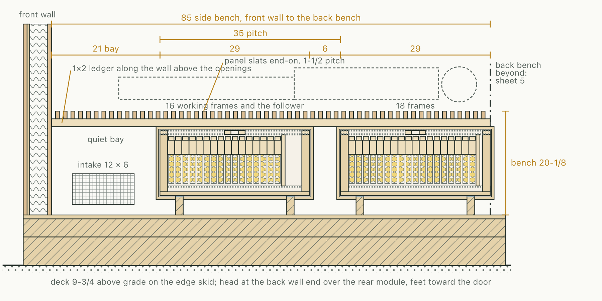

Along a side wall, cut through the two side modules and seen from the room. The rear module ends at the back bench, 85 from the front wall; the front one sits 35 nearer the door on the same pitch, 6 between boxes, each in its 30-1/2 × 14-1/8 sleeve. The rear box holds 18 deep frames; the front one 16 working frames and the follower. The front 21 is the quiet bay over the 12 × 6 intake. The 1×2 ledger runs the length of the wall above the openings; the panel slats step past at 1-1/2 pitch. Bench top 20-1/8 above the deck.

## 5. Section C-C

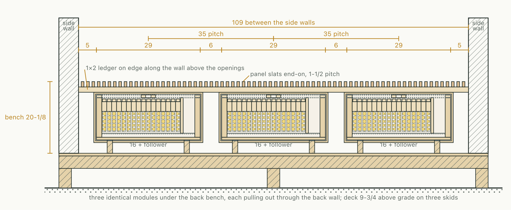

Along the back wall, cut through the three back modules and seen from the room. They sit on the 35 pitch centred on the 109 interior: 6 between boxes and 5 to each side wall, each in its 30-1/2 × 14-1/8 sleeve with 16 working frames and the follower. The ledger and the panel slats run the full width. Nothing is built in place: any module pulls out through the back wall and can be swapped for a spare.

## 6. Pull-out

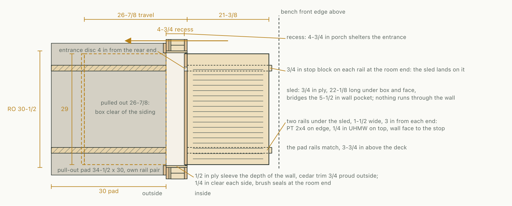

Plan detail of one side module at home and pulled out. The 29 in box sits in a 30-1/2 in rough opening lined with a 1/2 in ply sleeve, 1/4 in clear each side, its face at the room end of the sleeve so the entrance sits in a 4-3/4 in porch. Two rails inside run from the wall face to a 3/4 in stop block, 3 in from each end of the box; the apron outside, 30 in out from the siding, has its own pair. Neither passes through the wall: the sled bridges the 5-1/2 in pocket. Travel 26-7/8 in puts the box clear of the siding.

## 7. Side wall

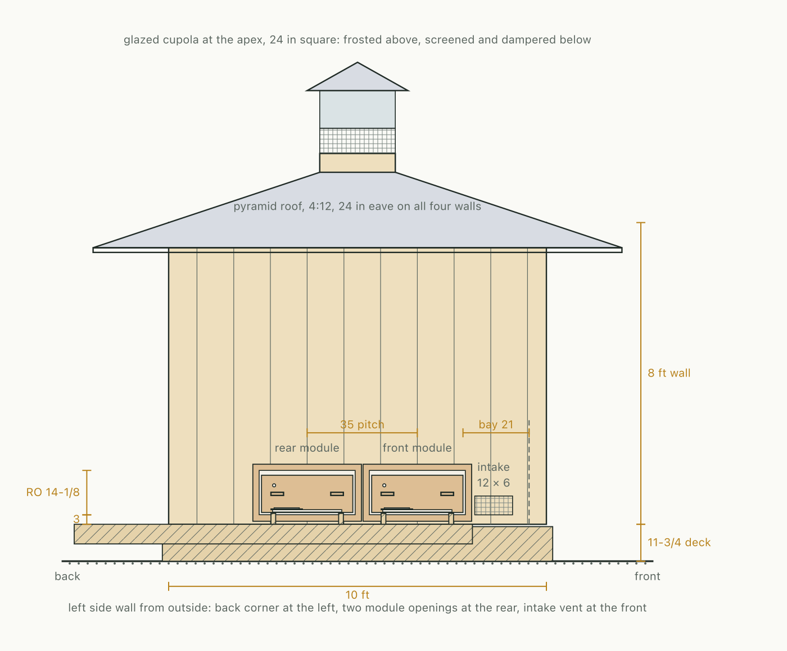

Left side wall from outside, back corner at the left. Two module openings, RO 30-1/2 × 14-1/8, sill 3 above the deck: the rear one centred 76 from the front exterior face (its box ends at the back bench), the front one 35 nearer the front, leaving the 21 in quiet bay. Intake vent 12 × 6, 5-1/4 from the front interior corner, sill 3 above the deck. The apron runs along the wall at deck height from 23-1/2 in behind the front face, rails under each opening.

## 8. Back wall

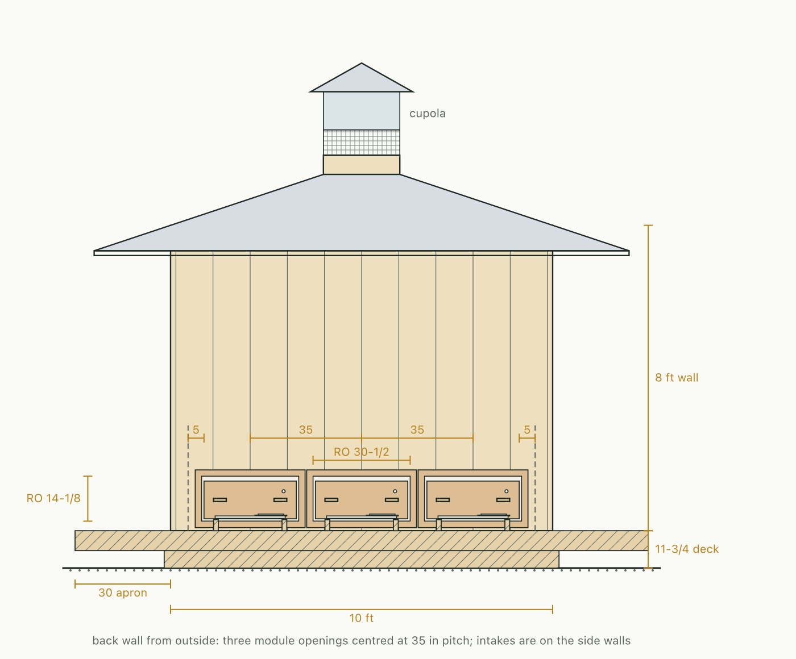

Back wall from outside: three module openings, RO 30-1/2 × 14-1/8, centred on the wall at 35 pitch, so 6 between boxes and 5 from each box to the interior corner. Sill 3 above the deck, the apron at deck height under all three. Intake vents are on the side walls.

## 9. Door wall

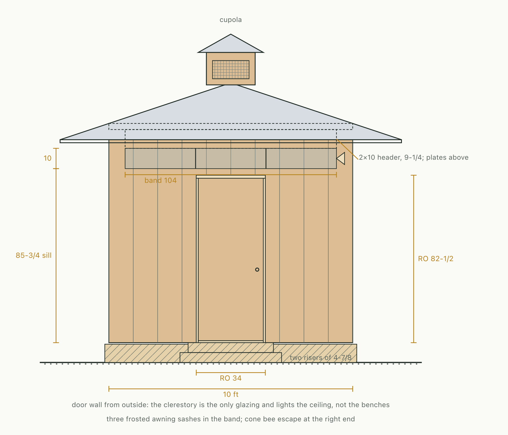

Front wall from outside, the only wall with no hive. Door RO 34 × 82-1/2 centred, 32 leaf inside 1 jambs under a 1-1/2 flat head and a doubled 2×6 header; two risers of 5-7/8 up to the deck with a handrail each side. No window: the glazed cupola over the aisle is the room's only daylight and where a stray bee leaves. The level soffit is 88 above the deck, 5-1/2 over the door.

## 10. Skids, floor and apron

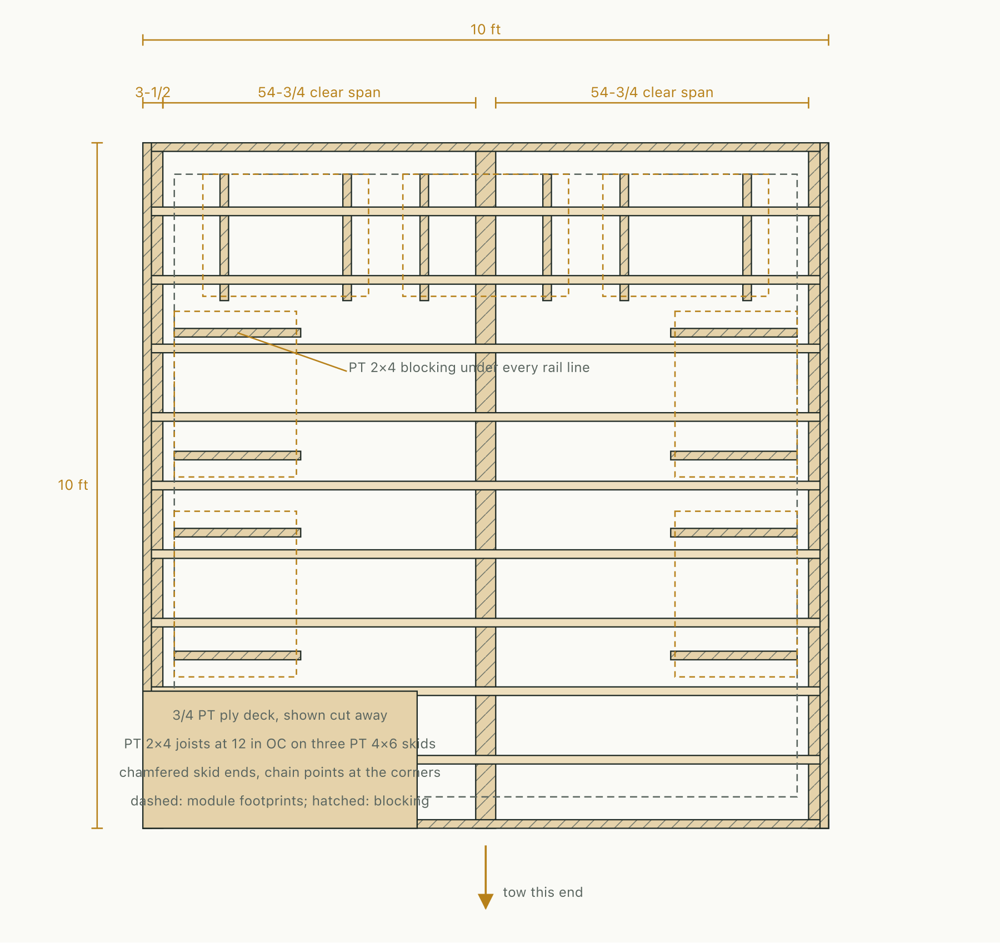

Three PT 4×6 skids on edge, 3-1/2 wide and 5-1/2 tall, run front to back on a compacted stone pad (8 in of crusher run in two lifts, 2 in of screenings), each bedded on 5 solid blocks set flush in the screenings as shim seats. PT 2×6 joists at 12 in on centre run across the skids, clear span 54-3/4, and from 23-1/2 in behind the front face to the back they run on 30 in past the siding on both sides as the apron, backspan 58-1/4 to the centre skid. Across the back, 2×6 outriggers bolted to both faces of every skid and lapped 60 carry the same joists 30 out. 3/4 in PT ply over all of it: the apron is the floor continued, rides with the building through a frost cycle, and its rails, one pair under every opening at 3-3/4, are set to the cartridge gauge. Three joists under a module carry 210 lb of module and a 250 lb person at the tip at about 610 psi. PT 2×4 blocking under every inside rail line. Chain points at the four edge-skid ends, an auger anchor strapped to each 12 in beyond the end, unclipped only to move the building; a 36 in stone apron at grade beyond the deck apron is where the beekeeper stands.

## 11. Frame

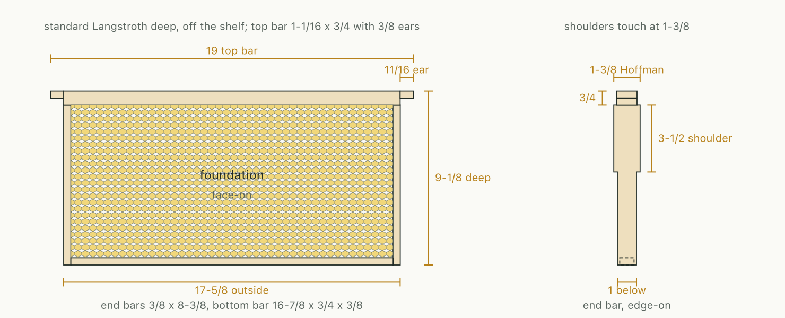

Standard Langstroth deep, off the shelf: 19 in top bar, 9-1/8 deep, 17-5/8 outside across the end bars. The Hoffman shoulders set the 1-3/8 spacing: 18 frames per module with a 3/4 follower, 16 working.

## 12. Hive floor

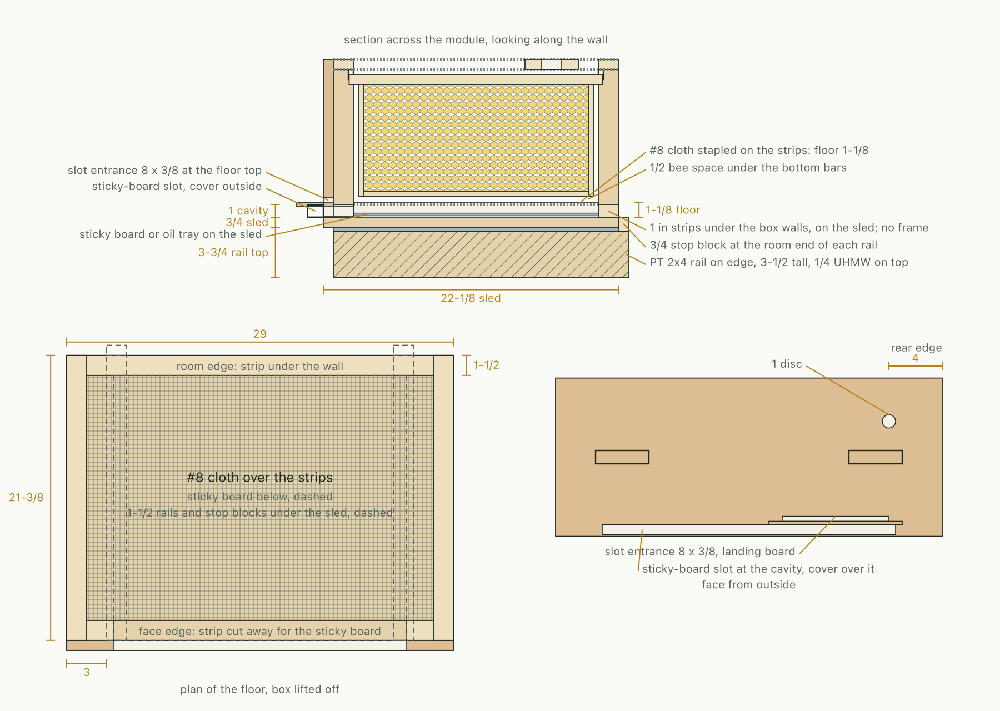

The module floor: a 1 in cavity formed by 1 in strips under the box walls on the 3/4 ply sled, #8 cloth stapled on top of the strips, so the floor is 1-1/8 (1 plus cloth and staples). A sticky board slides in through a slot in the face at the cavity, behind a cover. The slot entrance, 8 x 3/8, sits at the floor top at the rear edge under the 1 disc, 4 from the rear end. Two rails 3 from each end carry the sled to a 3/4 stop block; 1/2 bee space under the bottom bars.

## 13. Viewing port

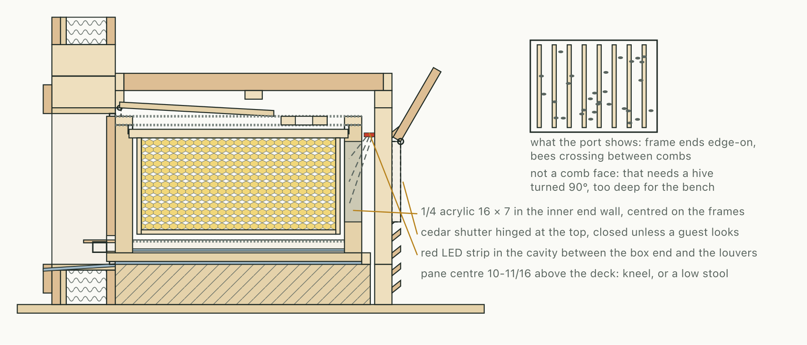

Section A-A through the one module with a port: a 16 × 7 acrylic pane let into the box's inner end wall, centred on the frame depth, and a hinged cedar shutter in the louvered bench front in line with it. A red LED strip in the dark cavity between the box end and the louvers lights the frame ends; the shutter stays closed unless a guest is looking. The pane centre is 10-11/16 above the deck: kneel, or a low stool.

## 14. Bench panel

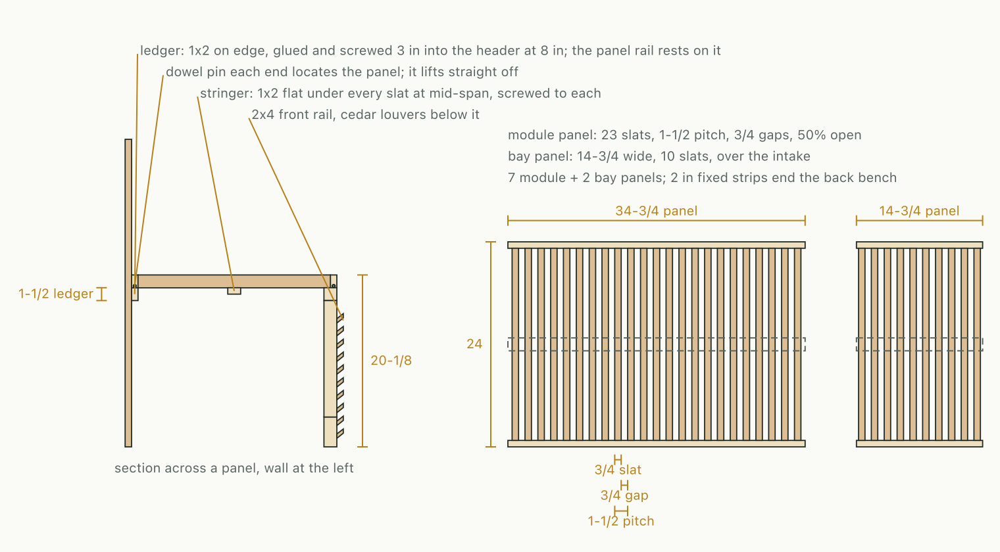

One lift-off ladder panel per module, 34-3/4 x 24 in on the 35 in module pitch, so every joint falls over the framing between openings and lifting a panel uncovers one board: two 1x2 rails on edge along the wall, 23 slats of 1x2 cedar on edge across the bench at 1-1/2 in pitch (3/4 in gaps, 1/2 in from each end), one 1x2 stringer flat under them at mid-span, screwed to every slat. A 14-3/4 in bay panel (10 slats) closes the front of each side bench; a fixed 2 in cedar strip each end of the back bench. The panel drops onto the 1x2 ledger on the wall above every opening and the 2x4 front rail, located by a dowel pin at each end, top at 20-1/8 in; nothing rests on the module, which slides under it with 2-1/4 in clear over the board. 7 module panels and 2 bay panels, clear vertical-grain cedar, each tested to 200 lb at the centre without visible set.

## 15. Double screen board

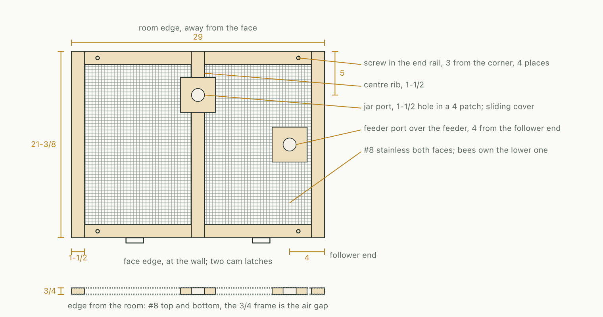

Double screen board, 29 x 21-3/8, one per module: a 1x2 flat frame 3/4 thick (1-1/2 wide) with a centre rib, #8 stainless on both faces, so the frame thickness is the air gap. Two ports, each a 1-1/2 hole in a 4 x 4 solid patch: the jar port centred along the board, 5 from the room edge, with a sliding cover that is closed unless a jar is on; the feeder port 4 from the follower end, over the frame feeder, for a funnel. Two cam latches hold the board to the box; the four screws, 3 along each end rail and 3/4 in from the edge, are the winter fixing.

## 16. Exploded assembly

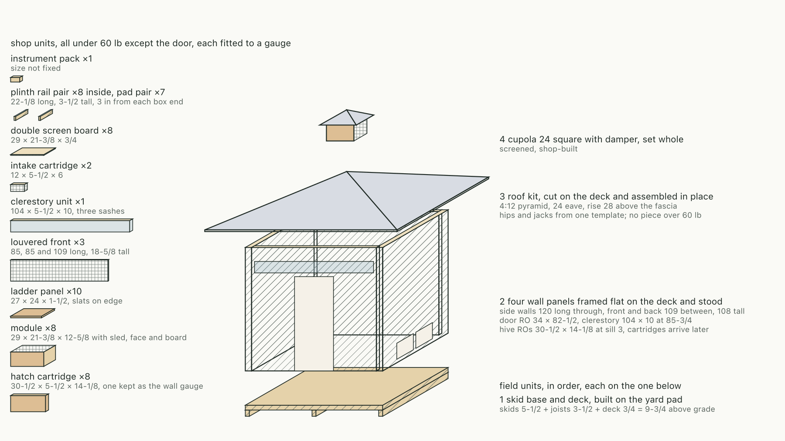

The building as units. Field units stack in order on the one below: skid base and apron (11-3/4 to the deck), four wall panels (117-1/2 side walls through, 110-1/2 front and back between them, 96 tall) framed flat on that deck, a 4:12 roof kit rising 28 above the fascia, the 24 in cupola set whole. Shop units under 60 lb except the door, built while the lumber acclimates and fitted to gauges before any wall stands.

## 17. Hatch cartridge

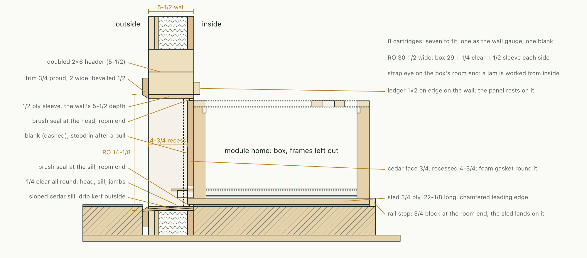

Section A-A at the wall, large scale. The cartridge is a 1/2 in plywood sleeve the depth of the wall (5-1/2), with the cedar trim frame outside (3/4 proud of the siding, 2 wide, its inner edge bevelled 1/2 as the lead-in), a sloped cedar sill with a drip kerf on the sleeve sill, a foam gasket round the face where it meets the porch, and brush seals at the room end filling the 1/4 in clearance. It slides into a bare 30-1/2 × 14-1/8 rough opening from outside and is screwed through the jambs; the sill sits 3 above the deck so the sleeve sill top is flush with the rail tops, and the rails are set to it with the gauge after the cartridge is in. No flap and no stops: when a module is out, one loose 3/4 in blank on a handle (dashed), the size of the sleeve, stands in against the seals from outside and the room stays bee-tight. Build eight cartridges, seven to fit and one kept as the gauge, and one blank.

## 18. Roof and cupola

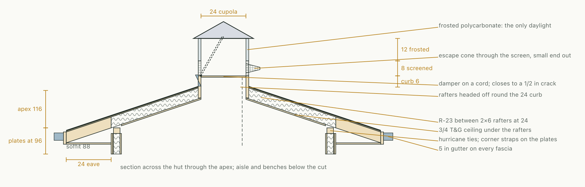

Section across the hut through the apex. 2×6 jack rafters at 24 in on 2×8 hips, 4:12, bearing on the double top plate at 96 with hurricane ties at every rafter and a strap across each corner, because a pyramid has no ceiling ties and the plates are its tension ring. Level soffit at 88, 24 in eave, 5 in gutter on every fascia. R-23 mineral wool fills the rafters and 3/4 in T&G closes the ceiling under them, so nothing over a sleeper's head is bare metal and a cold roof does not sweat on seven colonies in February. At the apex, 116 above the deck, the rafters are headed off round a 24 in square curb standing 6 in above the roof, flashed. On it the cupola: a 8 in band screened with #8 on all four sides carrying the damper, a 3/4 in ply leaf hinged in the throat on a cord to the room that closes to a 1/2 in crack, and the escape cone, a screen cone through the band with its small end outside; above that a 12 in band of frosted polycarbonate on all four sides, the room's only daylight, and its own cap rising 9 with 4 in of overhang. A bee in the room rises to the light and leaves by the cone.

## 19. Site

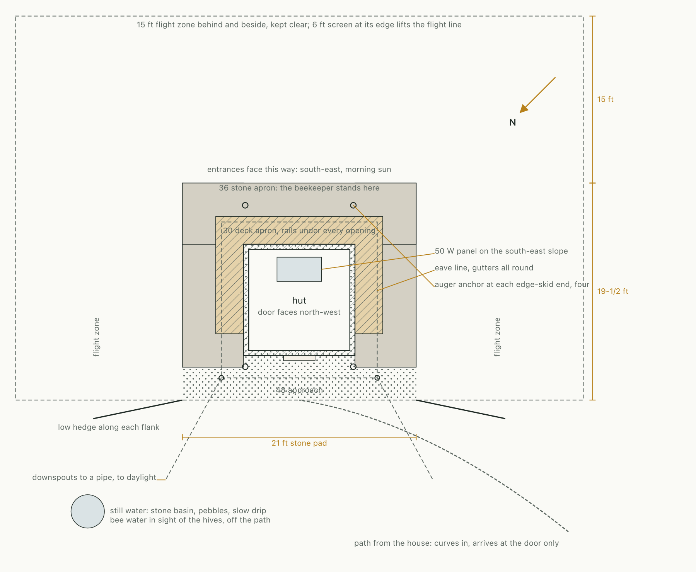

The site, door wall to the north-west so the back wall and its three entrances face south-east into the morning sun and the door is the far end from every entrance; ground rising gently behind, a windbreak 40 to 60 ft beyond the back wall. A 21 × 19-1/2 ft compacted stone pad (topsoil stripped, geotextile, 8 in crusher run in two lifts, 2 in screenings, PT 6×6 curb on the cut and downhill sides) carries the skids on solid blocks, the 30 in deck apron on three sides, a 36 in stone apron at grade beyond it for the beekeeper, and a 48 in approach at the door. Four auger anchors at the edge-skid ends. Gutters on every eave, downspouts at the front corners into a buried pipe to daylight away from the flight zones. A 15 ft flight zone kept clear behind and beside the hut with a 6 ft screen at its edge; the path arrives at the door only, curving in from the front-right so the building is first seen corner-on; a low hedge along each flank keeps guests off the side-wall flight lines. Still water in a stone basin with pebbles 20 ft off the front-left corner, in view from the path and off it. Solar panel on the south-east slope. On a slope, cut a level bench, never fill; French drain uphill. Re-level in April yearly: the door closes and a module runs to its stop on every wall.

## 20. Hive wall from inside

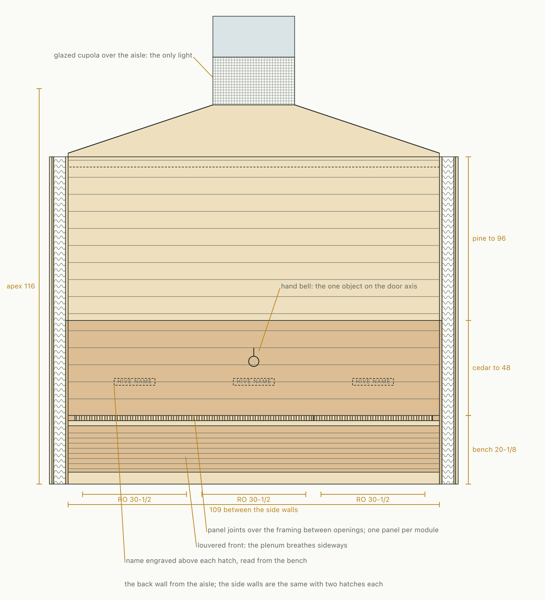

The back wall from the aisle: what a guest sees. The louvered 2×4 front, 18-5/8 tall, the slat ends of the three module panels and the bench top at 20-1/8, a fixed 2 in cedar strip at each end; cedar T&G to 48 in, pine above to the plates at 96; the ceiling rising on the hips to the glazed cupola over the aisle. Each hive's name engraved small on the wall 30 in above the deck over its hatch, so a guest on the bench can read which colony is under them; a hand bell for the host hung at the centre of the wall at 36 in, the one object at the end of the line from the door. Nothing else on the wall: no shelf, no readout, no light. The side walls are the same, two hatches each; the viewing port with its shutter is in the right-hand front module's louvers.

## 21. Side wall framing

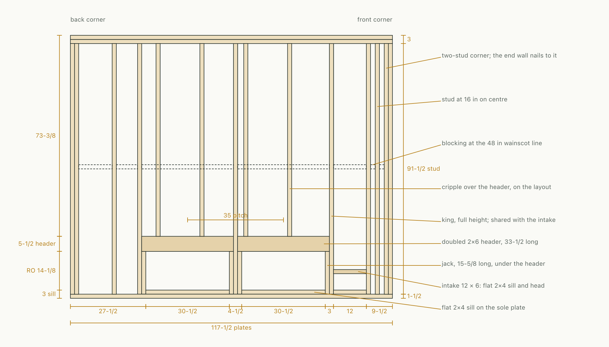

Left side wall framed flat on the deck, seen from outside, back corner at the left; the right wall is its mirror. Plates 117-1/2 long, the through wall, so each end is a two-stud corner that the end wall's end stud nails to. Studs 91-1/2 (a 92-5/8 precut trimmed) at 16 in from the back end, sole plate and double top plate to 96. Two module openings, RO 30-1/2 × 14-1/8 on 35 centres, sill 3 on a flat 2×4 over the sole plate, a jack and a king each side and a doubled 2×6 header (5-1/2); cripples over it at the layout. The intake, 12 × 6 on a flat 2×4 at 3, is small enough for a stud each side and shares the front module's king. Blocking at the 48 in wainscot line takes the sheathing edge and the T&G change. Test every module opening with the cartridge gauge before the sheathing goes on.

## 22. Back wall framing

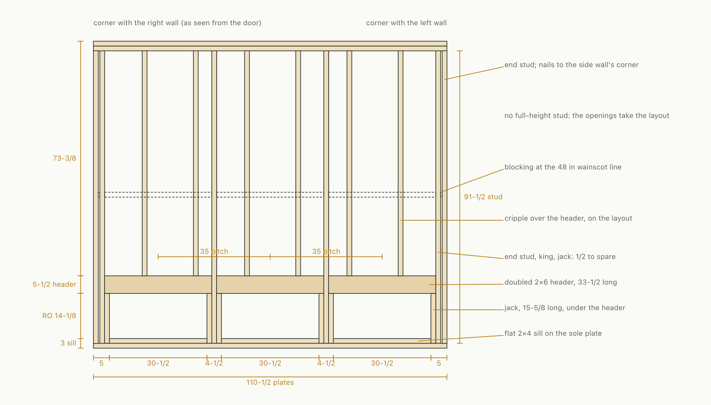

Back wall framed flat on the deck, seen from outside. Plates 110-1/2 long, standing between the side walls' studs. Studs 91-1/2 at 16 in from the left end, sole plate and double top plate to 96. Three module openings, RO 30-1/2 × 14-1/8, centred on the wall at 35 in, sill 3 on a flat 2×4, a jack and a king each side under a doubled 2×6 header, cripples over it at the layout. At each end the wall's end stud, the outer module's king and its jack fit in the 5 from the side wall's stud face to the RO, with 1/2 to spare; the end stud nails through to the side wall's two-stud corner. Blocking at the 48 in wainscot line. Test every opening with the cartridge gauge before sheathing.

## 23. Front wall framing

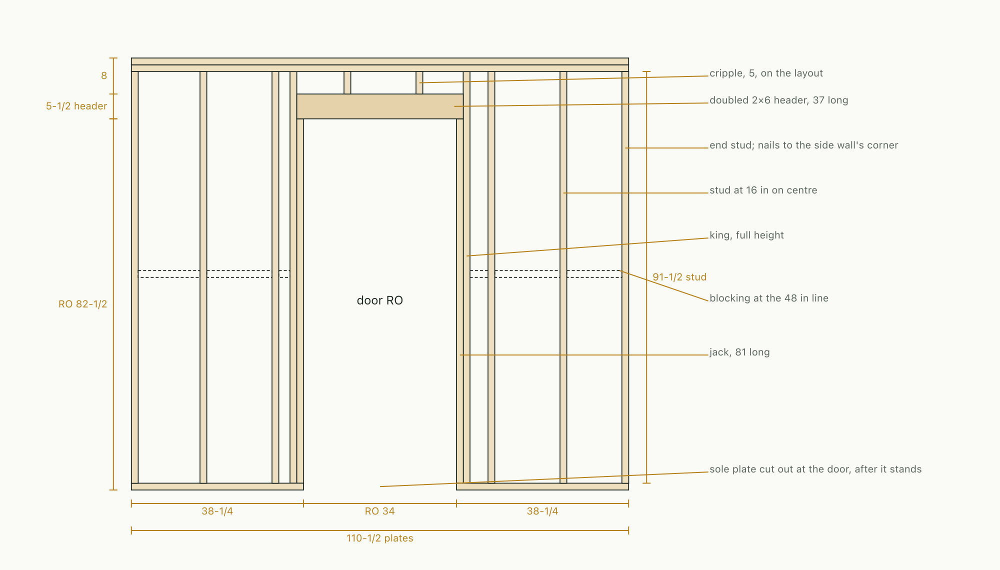

Front wall framed flat on the deck, seen from outside, the door wall. Plates 110-1/2 long between the side walls' studs, studs 91-1/2 at 16 in, double top plate to 96. The door RO, 34 × 82-1/2 centred, cuts the sole plate out between the jacks; a jack and a king each side under a doubled 2×6 header, 5 cripples over it to the plate. No window: the cupola is the glazing. The pre-hung door takes 1 a side in the RO and a 1-1/2 head. Blocking at the 48 in line, the same as the hive walls, so the T&G change runs round the room.

## 24. Roof framing plan

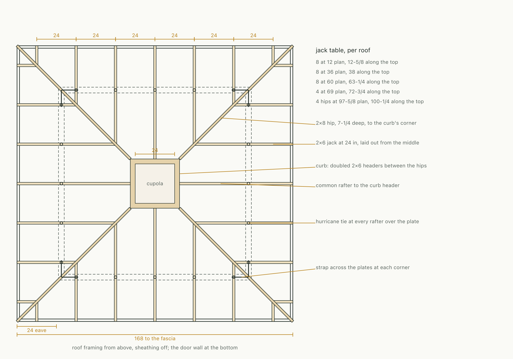

The roof from above with the sheathing off: four 2×8 hips (7-1/4 deep) from the fascia corners to the corners of the cupola curb's doubled 2×6 header ring, a 24 in opening at the apex; 2×6 jack rafters at 24 in on centre, laid out from the middle of each wall so the four faces are the same, the middle one a common rafter to the curb header. Every piece is cut on the deck from one hip template and the jack table: 4:12 plumb cut on the jacks, 4:17 on the hips, lengths along the top edge to the hip's centreline, less half the hip's thickness measured on the 45. A hurricane tie at every rafter and hip where it crosses the double top plate; a strap across the plates at each corner, because a pyramid has no ceiling ties and the plates are its tension ring. Sub-fascia 24 out from the walls all round.

## 25. Module fabrication

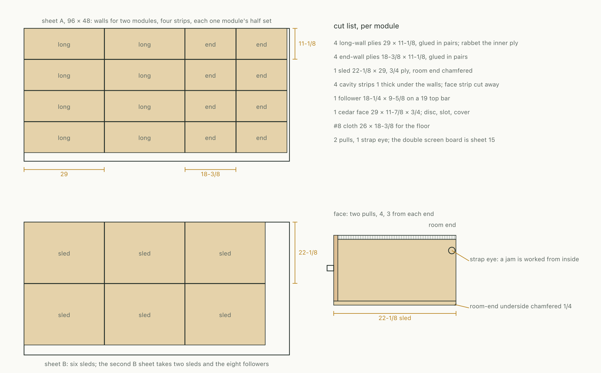

Cutting the modules. Box walls are two plies of 3/4 ply glued to 1-1/2: per module four long-wall plies 29 × 11-1/8 and four end-wall plies 18-3/8 × 11-1/8; the long walls, face side and room side, get the 3/8 × 3/4 rabbet in the inner ply after gluing, where the frame ears hang. One sheet walls two modules, four strips of 11-1/8 each carrying one module's half set. The sled is one 3/4 ply piece 22-1/8 × 29, six to a sheet, its room-end underside chamfered 1/4 as the lead-in to the sleeve. Followers 18-1/4 × 9-5/8 on a 19 top bar, felted at the edges to be bee-tight. Eight modules take four sheets of walls, two of sleds and followers and one spare: seven. The cedar face (29 × 11-7/8), the 1 in cavity strips, the two 4 in pulls at 3 from each end and a strap eye on the room end complete the box.

## 26. Cartridge fabrication

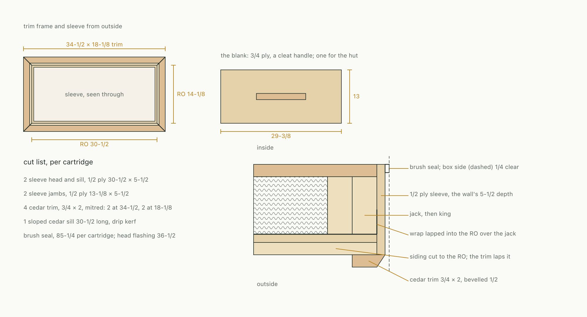

Making the hatch cartridge, eight of them, and the one blank. The sleeve is 1/2 in ply the depth of the wall: head and sill 30-1/2 × 5-1/2, jambs 13-1/8 × 5-1/2 between them, glued and nailed square on the gauge module with 1/4 all round. The cedar trim frame, 3/4 thick and 2 wide, is mitred to 34-1/2 × 18-1/8 outside, its inner edge bevelled 1/2 so the sled finds the sleeve; it lies on the siding, which is cut to the RO. The wrap is lapped into the RO over the jacks before the sleeve goes in, a head flashing goes over the trim under the wrap above, and the sloped cedar sill (sheet 17) sheds past the siding. Brush seals line the sleeve's room end. The blank is 3/4 ply 29-3/8 × 13, the sleeve's inside less 1/8, with a cleat handle; it stands in against the seals from outside.

## 27. Intake cartridge

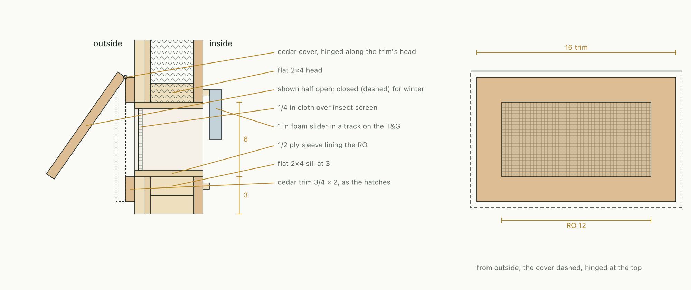

The two intakes, low in the side walls under the quiet bays. A 1/2 in ply sleeve lines the 12 × 6 RO, which sits on a flat 2×4 at 3 and under a flat 2×4 head, between the front module's king and one stud (sheet 21). At the outer end, 1/4 in hardware cloth over insect screen; round it the same cedar trim as the hatches, 3/4 × 2. A cedar cover hinged along the trim's head sheds rain half open and closes flat for winter. Inside, a 1 in foam slider runs in a track on the T&G and sets the opening from shut to full; the operating rules set it for sessions and for winter.
