# Sheets

Generated by build.py from beehut/sheets/; do not edit. Dimensions in inches, heights above the deck.

## 0. Cover, index and legend

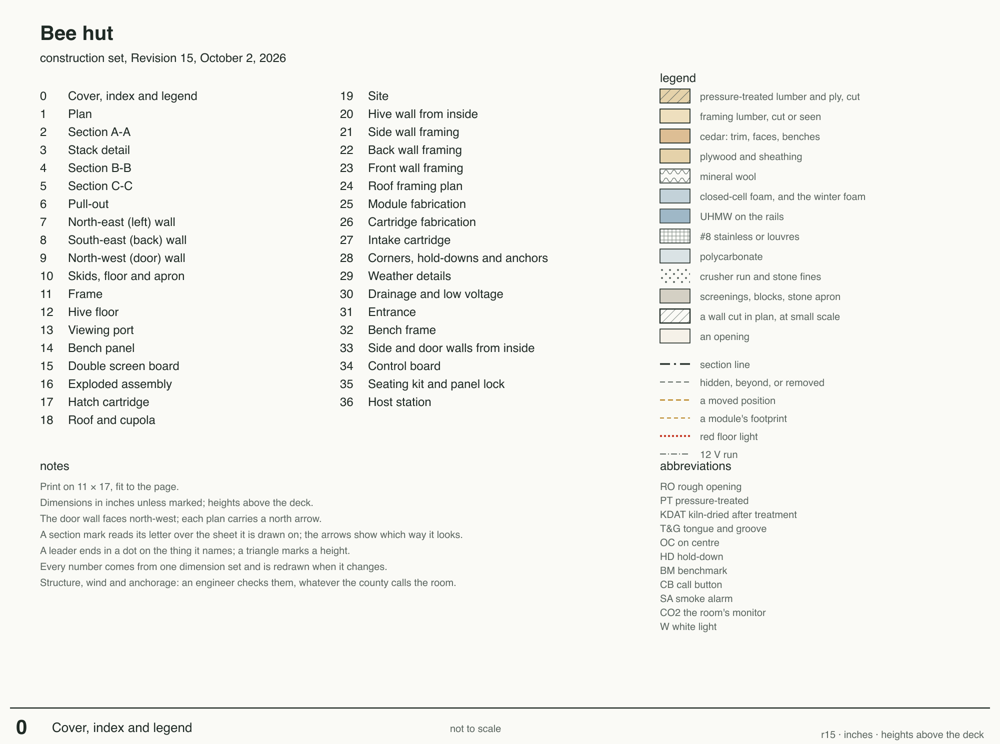

The set's cover: what each sheet is, what each fill and line means, and how to read the marks. Print on 11 × 17, fit to the page; every sheet carries its number, title, scale and revision in its strip.

## 1. Plan

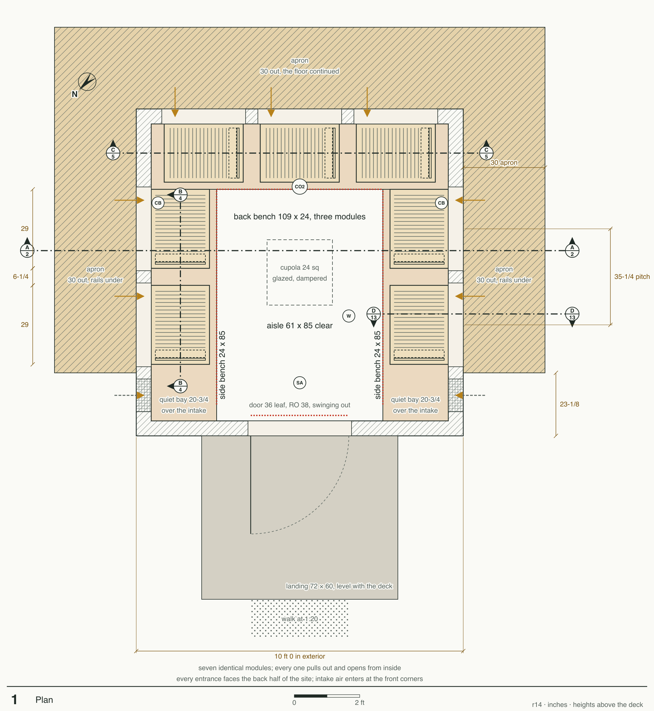

Skid-built 120 in square, 5-1/2 in walls, 109 in clear inside. Seven identical modules on a 35-1/4 in pitch: two at the rear of each side bench (the rear one ending at the back bench, 6-1/4 in between them) and three centred on the back wall, 6-1/4 in apart and 4-3/4 in from each corner. Each pulls out through a 30-3/4 in rough opening onto the 30 in apron; entrances at the rear edge of every face. A 20-3/4 in quiet bay at the front of each side bench sits over the 12 in intake, 3-3/8 in from the front corner. Door 36 in leaf in a 38 in opening, swinging out onto a 72 × 60 landing level with the deck; 24 in glazed cupola over the centre of the aisle. Red floor lights along the bench fronts and across the door, the CO2 monitor (CO2) between the lying guests' heads, call buttons (CB) at the head of each side bench, a smoke alarm (SA) by the door and a white light (W) over the aisle.

## 2. Section A-A

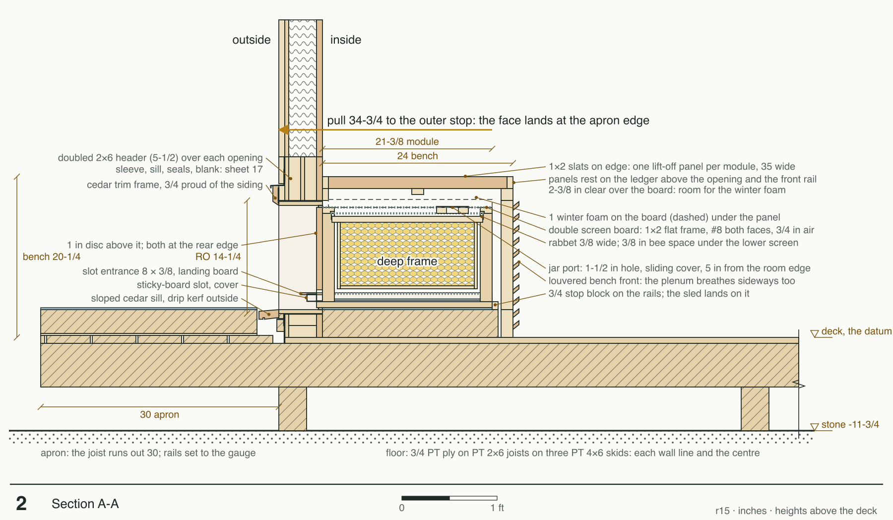

Across a side bench through a module, looking along the wall. The module (21-3/8 deep, 12-5/8 tall with its sled and double screen board) rides on two KDAT 2×4 rails with UHMW tops, 3-3/4 above the deck, and passes through the hatch cartridge in a 30-3/4 × 14-1/4 rough opening whose sill is 3 above the deck. The bench is a separate structure: a 1×2 ledger on the wall above the opening and a louvered 2×4 front rail carry lift-off ladder panels, 2-3/8 in clear over the board, bench top 20-1/4 above the deck. Pull the module 34-3/4 in to the outer stop at the apron's tip for an inspection, from the stone apron with a hook bar; feeding is with the panel off, since no jar fits under it. Deck 11-3/4 above grade on PT 4×6 skids.

## 3. Stack detail

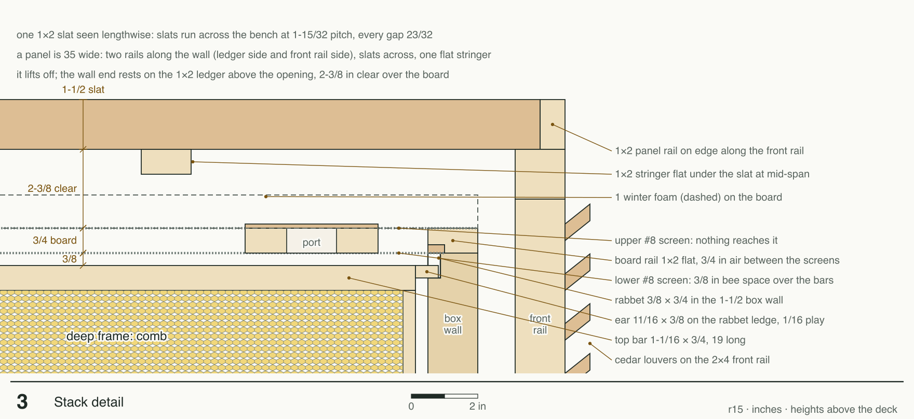

The top corner of a module at the room end, from Section A-A at large scale. The frame ear (11/16 × 3/8) sits on the rabbet ledge (3/8 wide) in the 1-1/2 box wall, leaving 3/8 in bee space between the top bars and the lower #8 screen. The double screen board is a 1×2 flat frame with #8 on both faces and 3/4 in air between: bees own the lower screen and nothing reaches the upper one. The bench panel clears the board by 2-3/8, room for 1 in winter foam under the stringer. In this cut across the bench you see one 1-1/2 in slat lengthwise between its two panel rails, the flat stringer under it, and the louvered 2×4 front rail.

## 4. Section B-B

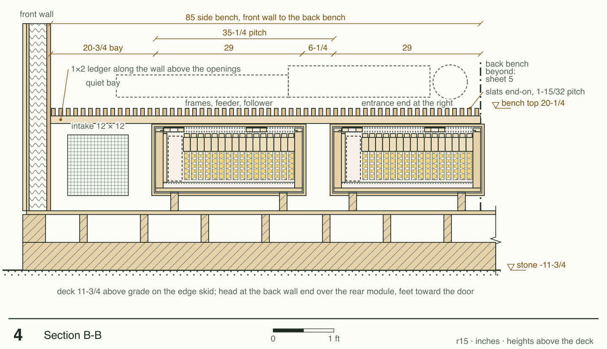

Along a side wall, cut through the two side modules and seen from the room. The rear module ends at the back bench, 85 from the front wall; the front one sits 35-1/4 nearer the door on the same pitch, 6-1/4 between boxes, each in its 30-1/2 × 14-1/8 sleeve. Every box is laid out the same from its entrance end, the rear: 16 deep frames from the first at the entrance, a frame feeder in the last two places (a dummy when it is out), and the follower on the far wall with a strip that meets the lower screen. The jar port is over frame 6 and the feeder port over the feeder. The front 20-3/4 is the quiet bay over the 12 × 12 intake. The 1×2 ledger runs the length of the wall above the openings; the panel slats step past at 1-15/32 pitch, every gap 23/32, the joints too. Bench top 20-1/4 above the deck.

## 5. Section C-C

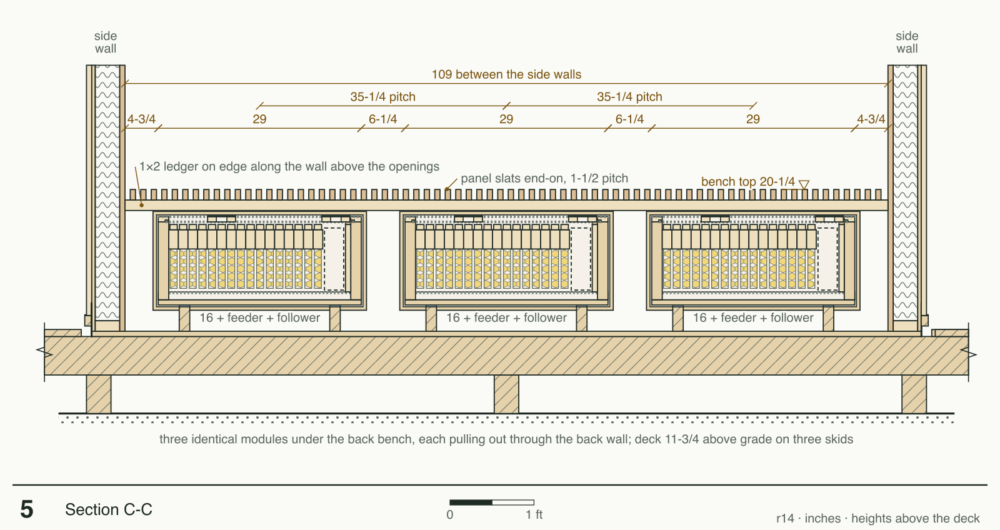

Along the back wall, cut through the three back modules and seen from the room. They sit on the 35-1/4 pitch centred on the 109 interior: 6-1/4 between boxes and 4-3/4 to each side wall, each in its 30-1/2 × 14-1/8 sleeve with 16 working frames from its entrance end (the left, seen from the room), the feeder and the follower. The ledger and the panel slats run the full width. Nothing is built in place: any module pulls out through the back wall and can be swapped for a spare.

## 6. Pull-out

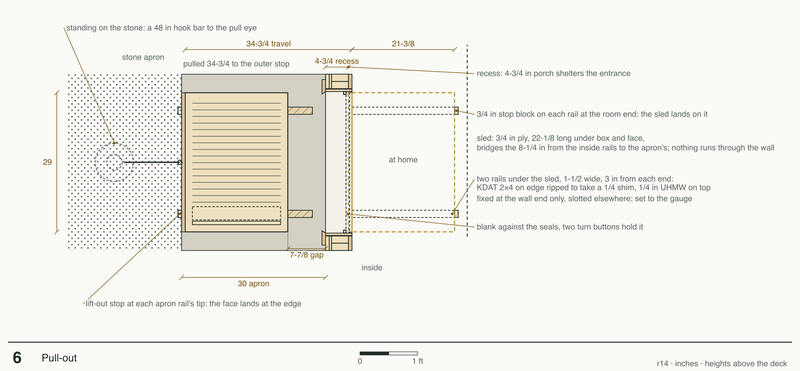

Plan detail of one side module at home and pulled out. The 29 in box sits in a 30-3/4 in rough opening lined with a 1/2 in ply sleeve, shimmed 1/8 each side, 1/4 in clear each side of the box, its face at the room end of the sleeve so the entrance sits in a 4-3/4 in porch. Two rails inside run from the wall face to a 3/4 in stop block, 3 in from each end of the box; the apron's pair runs 27-1/4 from 2-3/4 off the siding, clear of the sloped sill, to a lift-out stop at the tip. The sled bridges the pocket between them. Standing on the stone apron, the beekeeper hooks the pull eye at the centre of the sled's edge, 34-3/4 in from the apron's edge with the module home, with a 48 in bar and draws the module 34-3/4 in to the outer stop, so its face lands at the apron's edge: the top bars are then 27 above the stone and the far ears 20-15/16 in from the edge, within reach. Between the box and the siding is a 7-7/8 in gap, where a blank goes into the sleeve against the seals and two turn buttons on the sleeve's jambs hold it. Brush the porch clear and push home slowly, so no forager is swept into the seals.

## 7. North-east (left) wall

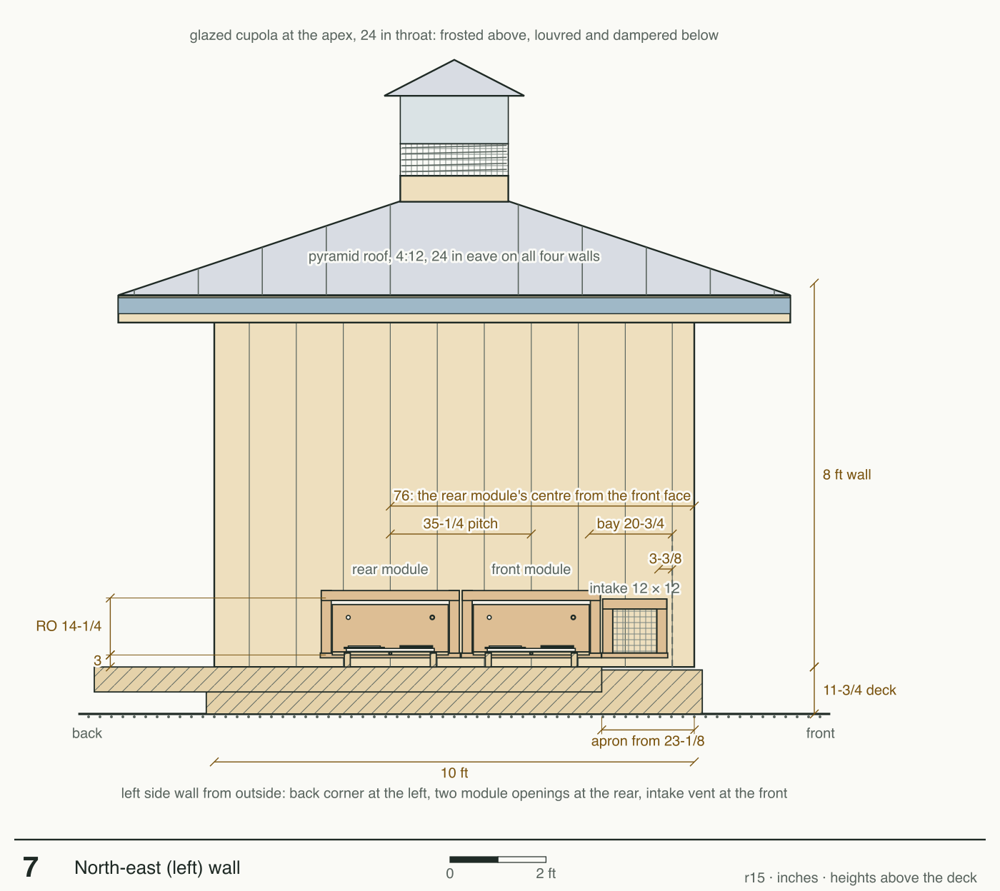

The north-east wall, the left one as seen from the door, from outside, back corner at the left; the south-west wall is its mirror. Two module openings, RO 30-3/4 × 14-1/4, sill 3 above the deck: the rear one centred 76 from the front exterior face (its box ends at the back bench), the front one 35-1/4 nearer the front, leaving the 20-3/4 in quiet bay. Intake vent 12 × 12, 3-3/8 from the front interior corner, sill 3 above the deck. The apron runs along the wall at deck height from 23-1/8 in behind the front face, rails under each opening.

## 8. South-east (back) wall

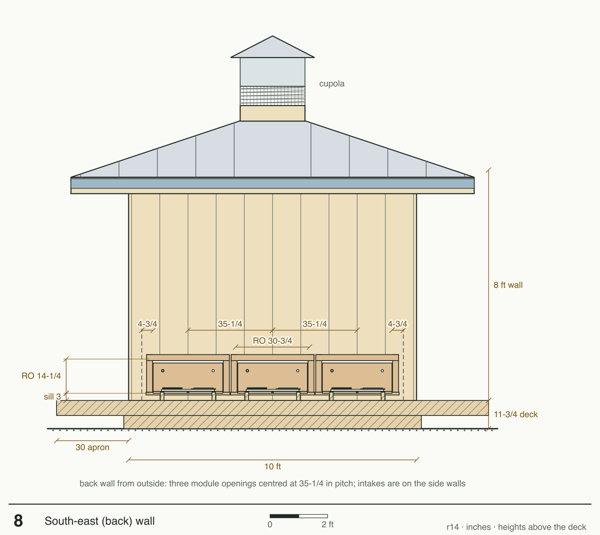

The south-east wall, the back, from outside: three module openings, RO 30-3/4 × 14-1/4, centred on the wall at 35-1/4 pitch, so 6-1/4 between boxes and 4-3/4 from each box to the interior corner. Sill 3 above the deck, the apron at deck height under all three. Intake vents are on the side walls.

## 9. North-west (door) wall

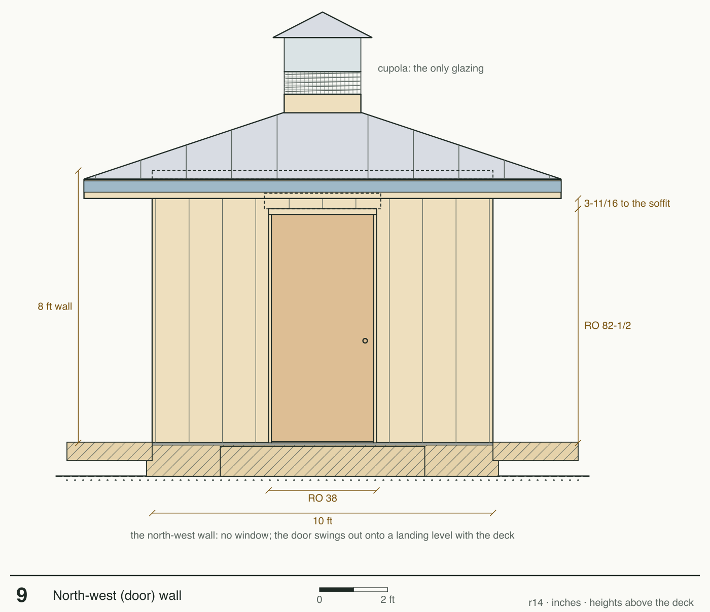

Front wall from outside, the north-west wall, the only one with no hive. Door RO 38 × 82-1/2 centred, a 36 leaf swinging out inside 1 jambs under a 2 flat head and a doubled 2×6 header; a 72 in landing level with the deck in front of it, and a walk at 1:20 coming toward you, no step. No window: the glazed cupola over the aisle is the room's only daylight and where a stray bee leaves. The level soffit is 86-3/16 above the deck, 3-11/16 over the door.

## 10. Skids, floor and apron

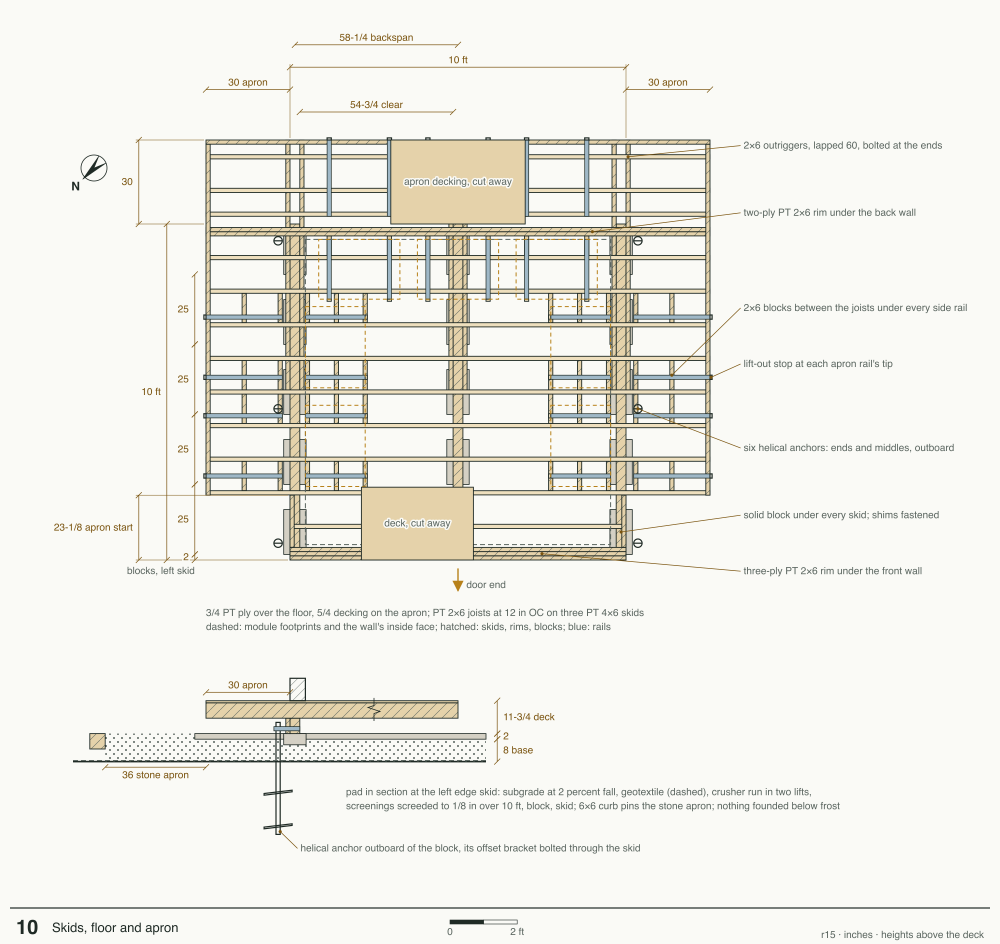

Three PT 4×6 skids on edge, 3-1/2 wide and 5-1/2 tall, run front to back on a compacted stone pad (8 in of crusher run in two lifts, 2 in of screenings), each bedded on five solid blocks set flush in the screenings, the shims fastened to them. PT 2×6 joists at 12 in on centre run across the skids, clear span 54-3/4; from 23-1/8 in behind the front face they run on 30 in past the siding on both sides as the apron, backspan 58-1/4 to the centre skid. Across the back, 2×6 outriggers bolted at the ends of their 60 in lap to both faces of every skid carry three more joists out 30 in, the first under the apron rails' wall ends, 2-3/4 off the siding and clear of the sloped sills. Every wall plate bears on framing: a two-ply PT 2×6 rim under the back wall, run full length over the skids and outriggers, a three-ply rim under the front wall, and the joists under the side walls. Every side-wall rail sits between two joists, so 2×6 blocks carry the rails at their ends and middles, inside and on the apron; the back rails cross the joists, with a block under each one's wall end where the sled crosses from the sleeve: 46 blocks. 3/4 in PT ply inside, and 5/4 decking gapped 1/4 on the apron, which is the floor continued and rides with the building through a frost cycle. The worst apron joist, carrying a 201 lb module pulled to its outer stop and half of a 250 lb person at the tip, works at 736 psi against 1150. Six helical anchors go in vertically beside the edge skids, 4-1/4 out from each skid's face, clear of its blocks: 6 in from each end and one at the middle between two joists, driven on the layout in October before the blocks go in; an offset galvanized bracket through-bolted to each skid, proven by one pull test in this soil. A 36 in stone apron at grade beyond the deck apron is where the beekeeper stands.

## 11. Frame

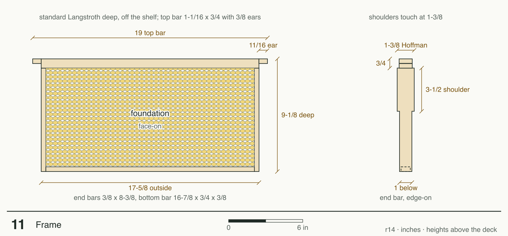

Standard Langstroth deep, off the shelf: 19 in top bar, 9-1/8 deep, 17-5/8 outside across the end bars. The Hoffman shoulders set the 1-3/8 spacing: 18 frames per module with a 3/4 follower, 16 working.

## 12. Hive floor

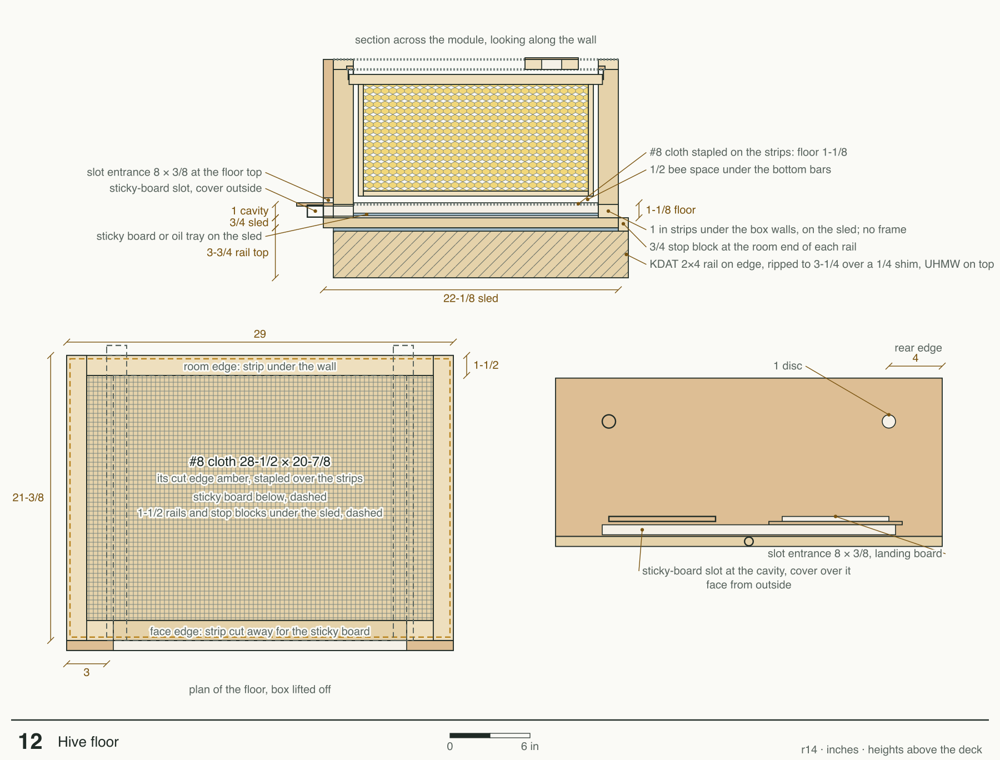

The module floor: a 1 in cavity formed by 1 in strips under the box walls on the 3/4 ply sled, #8 cloth stapled on top of the strips, so the floor is 1-1/8 (1 plus cloth and staples). A sticky board slides in through a slot in the face at the cavity, behind a cover. The slot entrance, 8 x 3/8, sits at the floor top at the rear edge under the 1 disc, 4 from the rear end. Two rails 3 from each end carry the sled to a 3/4 stop block; 1/2 bee space under the bottom bars.

## 13. Viewing port

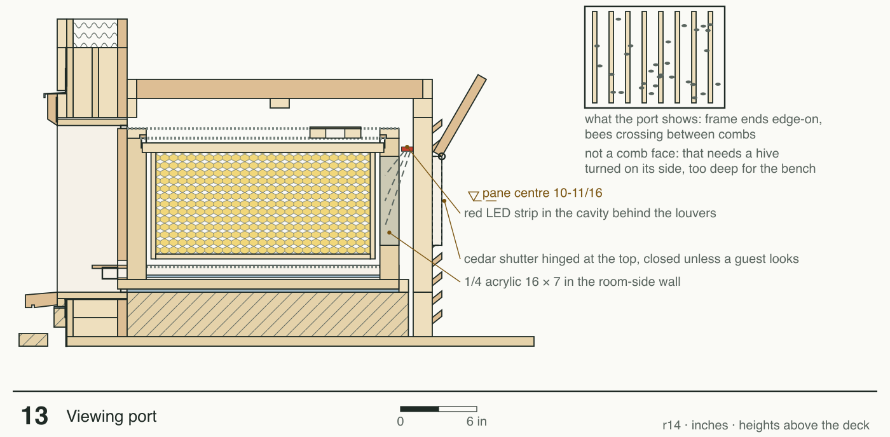

Section D-D through the one module with a port: a 16 × 7 acrylic pane let into the box's room-side wall (the long wall facing the aisle), centred on the frame depth, and a hinged cedar shutter in the louvered bench front in line with it. A red LED strip in the dark cavity between the box end and the louvers lights the frame ends; the shutter stays closed unless a guest is looking. The pane centre is 10-11/16 above the deck: kneel, or a low stool.

## 14. Bench panel

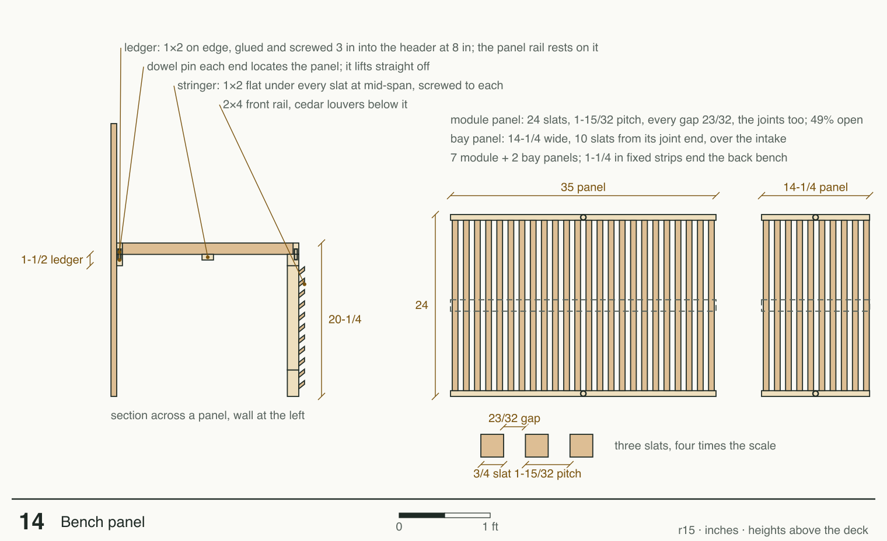

One lift-off ladder panel per module, 35 x 24 in on the 35-1/4 in module pitch, so every joint falls over the framing between openings and lifting a panel uncovers one board: two 1×2 rails on edge along the wall, 24 slats of 1×2 cedar on edge across the bench at 1-15/32 in pitch, one 1×2 stringer flat under them at mid-span, screwed to every slat. Every gap on a bench is 23/32, the joints between panels too: set the slats with a 23/32 spacer, an offcut of 23/32 sheathing ply, and centre them on the rails, so each end slat sits 15/64 in from its end and two of those and the 1/4 play make one gap. A 14-1/4 in bay panel closes the front of each side bench: 10 slats on the same spacer, run from its joint end, the 3/64 left over at the wall. A fixed 1-1/4 in cedar strip ends the back bench at each side wall, a gap from the first slat. The panel drops onto the 1×2 ledger on the wall above every opening and the 2×4 front rail, located by a dowel pin at each end, top at 20-1/4 in; nothing rests on the module, which slides under it with 2-3/8 in clear over the board. 7 module panels and 2 bay panels, clear vertical-grain cedar, each proven to 250 lb at any point without visible set.

## 15. Double screen board

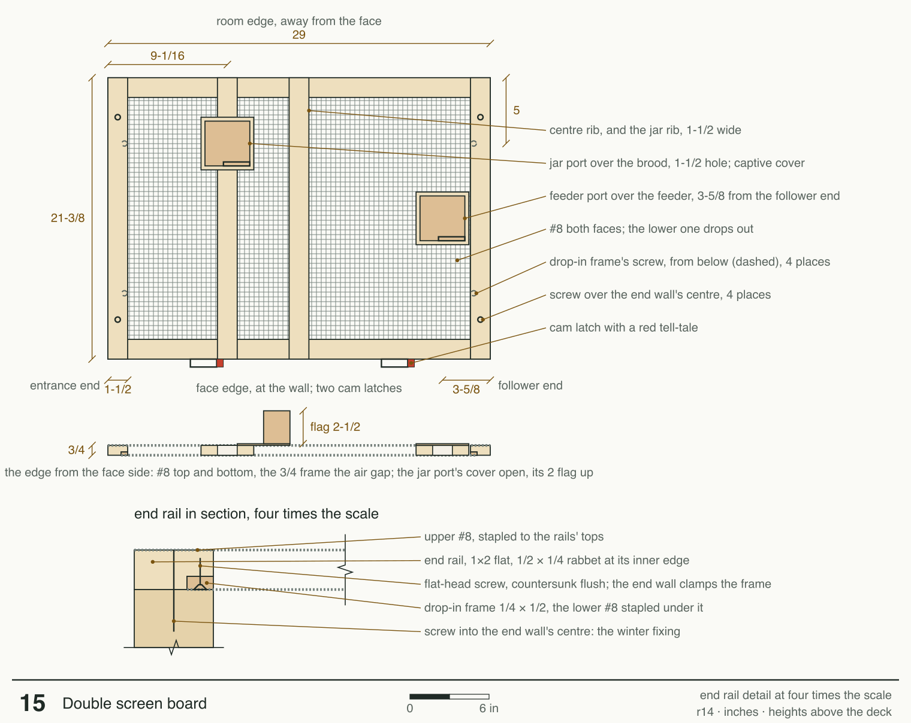

Double screen board, 29 x 21-3/8, one per module: a 1×2 flat frame 3/4 thick (1-1/2 wide) with a centre rib and a jar rib, #8 stainless on both faces, so the frame thickness is the air gap. The lower screen is stapled under its own 1/4 × 1/2 frame, which drops into a rabbet the same size at the inner edge of the board's underside, flush, held by four flat-head screws countersunk into it and clamped by the box when the board is latched, so the one screen the bees reach comes out for cleaning; a spare for every board. Two ports, each a 1-1/2 hole in a 4 x 4 solid patch, cut through both screens: the jar port on the jar rib, 9-1/16 from the entrance end over the brood and 5 from the room edge; the feeder port against the end rail, 3-5/8 from the follower end, over the frame feeder. Each has a captive sliding cover, 1/8 thick, that slides toward the board's middle, so neither runs off its end, and whose 2 in flag stands 2-1/2 tall across the board while the port is open: higher than the 2-3/8 in the panel clears the board, so no panel seats over an open port, and wider along the board than a slat gap, so it can't rise through one. Two cam latches hold the board to the box, each with a red tell-tale that shows until it is shut; the four screws, 3 along each end rail and 3/4 in from the edge, over the end walls' centres, are the winter fixing. Boards are handed: this is a left wall's; the right wall's and the back's are its mirror, the jar port always at the entrance end. The control board (sheet 34) is this board with planks in its field.

## 16. Exploded assembly

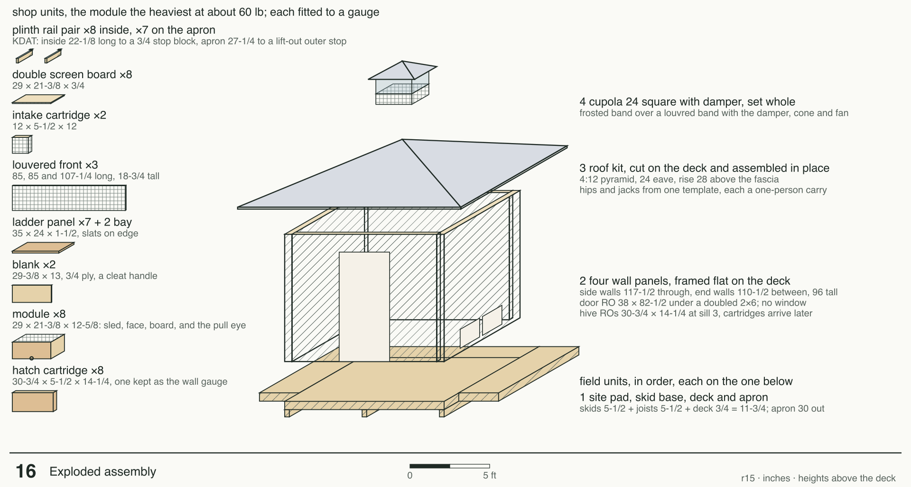

The building as units. Field units stack in order on the one below: skid base and apron (11-3/4 to the deck), four wall panels (117-1/2 side walls through, 110-1/2 front and back between them, 96 tall) framed flat on that deck, a 4:12 roof kit rising 28 above the fascia, the 24 in cupola set whole. The module, the heaviest shop unit, is about 60 lb empty; every shop unit is built while the lumber acclimates and fitted to a gauge before any wall stands.

## 17. Hatch cartridge

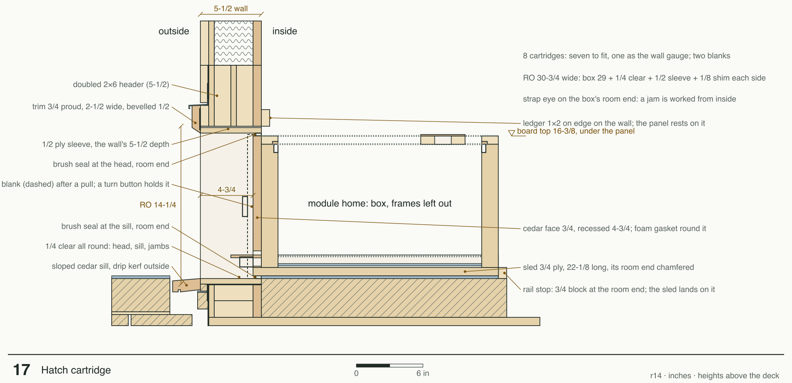

Section A-A at the wall, large scale. The cartridge is a 1/2 in plywood sleeve the depth of the wall (5-1/2), with the cedar trim frame outside (3/4 proud of the siding, 2-1/2 wide, its inner edge bevelled 1/2 as the lead-in), a sloped cedar sill with a drip kerf outside the sleeve, clear of the flashed water table at the wall's foot, a foam gasket round the face where it meets the porch, and brush seals at the room end filling the 1/4 in clearance. It slides into a bare 30-3/4 × 14-1/4 rough opening from outside and is screwed through the jambs; the sill sits 3 above the deck so the sleeve sill top is flush with the rail tops, and the rails are set to it with the gauge after the cartridge is in. No flap and no stops: when a module is out, a loose 3/4 in blank on a handle (dashed), the size of the sleeve's inside, goes in against the seals from the 7-7/8 in gap behind the pulled box, and two turn buttons on the sleeve's jambs hold it, so the room stays bee-tight. Build eight cartridges, seven to fit and one kept as the gauge, and two blanks.

## 18. Roof and cupola

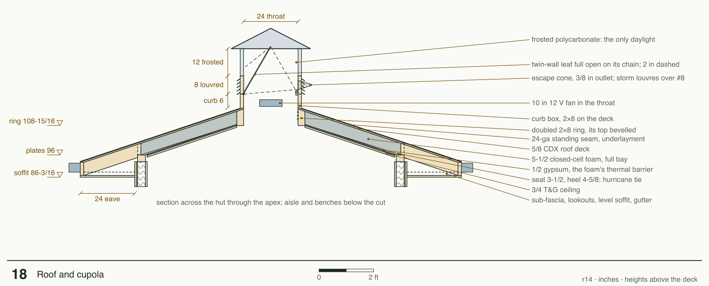

Section across the hut through the apex. 2×6 jack rafters at 24 in on 2×8 hips, 4:12, each seated on the double top plate at 96 with a seat cut 3-1/2 long and 4-5/8 of rafter left over the plate's outer edge; tails cut plumb 22-1/2 out, a 2×6 sub-fascia on them, so the eave is 24 to its face. Level soffit at 86-3/16 on lookouts, a 5 in gutter on every fascia. The roof is unvented: 5-1/2 in of closed-cell spray foam fills every bay against the 5/8 in deck, so the deck never sees the room's moist air, sealed to the plates and the ring and cured before the colonies come in; 1/2 in gypsum covers the foam as its thermal barrier, and 3/4 in T&G closes the ceiling. Over the deck, synthetic underlayment and 24-ga standing seam on clips, 1 in ribs at 16 in. At the apex a doubled 2×8 ring heads off the rafters round the 24 in throat, level underneath at 108-15/16 and its top bevelled to the pitch, so the deck runs over it to the throat and a 2×8 curb box sits on the deck, standing 6 in above the roof, flashed and weeped. On it the cupola, screwed and strapped to the curb: a 8 in band of #8 stainless behind drainable storm louvres, carrying the damper and the escape cone; a 12 in band of frosted polycarbonate, the room's only daylight; a cap rising 9 with 4 in of overhang. The damper is a twin-wall polycarbonate leaf, 5/16 thick, so light comes through it at every setting. It is hinged at the curb top on a cord marked in inches of lift, rests on a stop block that never lets it shut (1/2 in) and drains off a drip. Part open, it sends the air out through the band below it only, so for every session it is full open, as drawn, held there by a limit chain; dashed at 2 in, the least it is set to in winter. Its cord runs over a pulley on the far post and down the throat's wall, clear of the fan, to a cleat in the room, marked at the least opening, 2 in and full open. A 12 V fan hangs in the throat for a Visit. The cone's small end, 3/8 in across, is outside, so a bee in the room rises to the light and leaves.

## 19. Site

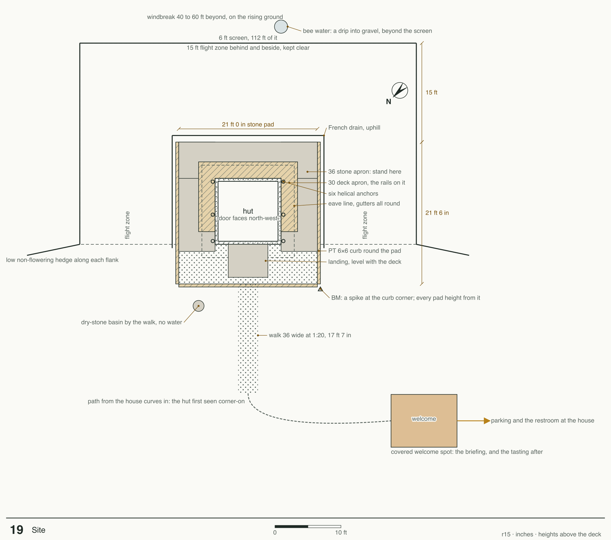

The site, door wall to the north-west, so the back wall and its three entrances face south-east into the morning sun, and the door is at the far end from every entrance. The ground rises gently behind, with a windbreak 40 to 60 ft beyond the back wall. A 21 ft 0 in × 21 ft 6 in compacted stone pad: topsoil stripped, geotextile, 8 in crusher run in two lifts, 2 in screenings, a PT 6×6 curb on the front and both flanks, and a benchmark at the front-right curb corner that every height on the pad is set from. It carries the skids on solid blocks, six helical anchors beside the edge skids, the 30 in deck apron on three sides with a 36 in stone apron beyond it where the beekeeper stands, and the landing at the door. A French drain across the uphill side; gutters on every eave into pipe to daylight ahead of the building (sheet 30). A 15 ft flight zone behind and beside the hut is kept clear, with a 6 ft screen at its edge, 112 ft of it. The bee water, a slow drip into a gravel basin, sits beyond the south-east screen and runs before the colonies arrive, so water foragers work the back of the site, never the approach. A low non-flowering hedge along each flank keeps guests off the side walls' flight lines. Guests park at the house, use its restroom, and wait at a covered welcome spot by the path, which is where the briefing and the tasting afterward happen; from there the path curves in from the front-right, so the building is first seen corner-on, and ends as a 36 in walk at 1:20, 17 ft 7 in long, rising to the landing. On a slope, cut a level bench, never fill. Re-level in April yearly: the door closes and a module runs to its stop on every wall.

## 20. Hive wall from inside

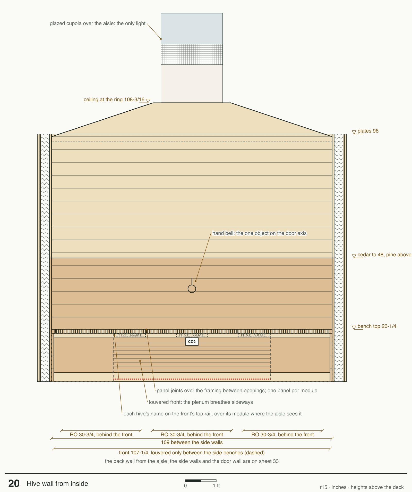

The back wall from the aisle: what a guest sees. The 2×4 front, 18-3/4 tall and 107-1/4 long between the side walls' ledgers, louvered along the aisle and plain behind the side benches' ends (dashed), with each hive's name on its top rail, over its module or as near as the aisle can see, and a red floor light along its toe; the slat ends of the three module panels, a joint between panels, and the bench top at 20-1/4, a fixed 1-1/4 in cedar strip at each end, a gap from the first slat. The CO2 monitor sits on the front's top rail at the centre, at head height between the two lying guests. Cedar T&G to 48 in, pine above to the plates at 96; the ceiling rises on the hips to the ring round the cupola's throat over the aisle, and through the throat the louvred band and the frosted band, the room's daylight. A hand bell hangs at the centre of the wall at 36 in, the session's end chime. The side walls and the door wall are on sheet 33.

## 21. Side wall framing

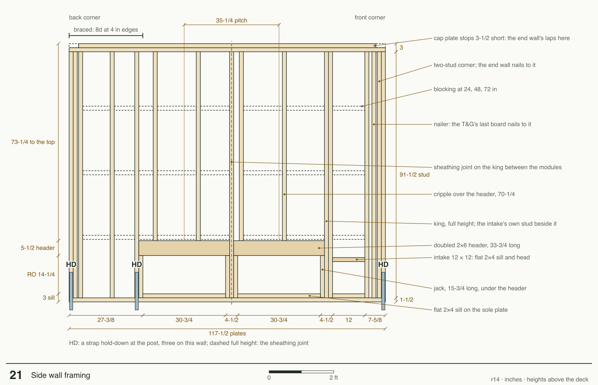

Left side wall framed flat on the deck, seen from outside, back corner at the left; the right wall is its mirror. Plates 117-1/2 long, the through wall, so each end is a two-stud corner that the end wall's end stud nails to, and a nailer stud stands where each end wall's framing meets it, so the T&G is nailed to its last inch. Studs 91-1/2 (a 92-5/8 precut trimmed) at 16 in from the back end under a top plate and a cap plate that stops 3-1/2 short of each end, where the end walls' cap plates lap over it and are nailed down. Two module openings, RO 30-3/4 × 14-1/4 on 35-1/4 centres, sill 3 on a flat 2×4 over the sole plate, a jack and a king each side and a doubled 2×6 header (5-1/2); cripples 70-1/4 long over it at the layout. The intake, 12 × 12 on a flat 2×4 at 3, has its own stud each side, a stud clear of the front module's king so their trims don't meet. Blocking rows at 24, 48, 72 in give the vertical siding its nailing and the sheathing and T&G their joint lines; no block is shorter than 3. Sheathing runs in two courses, no piece over 96 long, its vertical joints on the king between the modules. The whole wall is sheathed above and below its openings, and the back corner panel is its braced panel: nailed 8d at 4 in on its edges, 12 in in the field, with a strap hold-down at each marked post (sheet 28); the front end, cut by the intake, doesn't count. Test every module opening with the cartridge gauge before the sheathing goes on.

## 22. Back wall framing

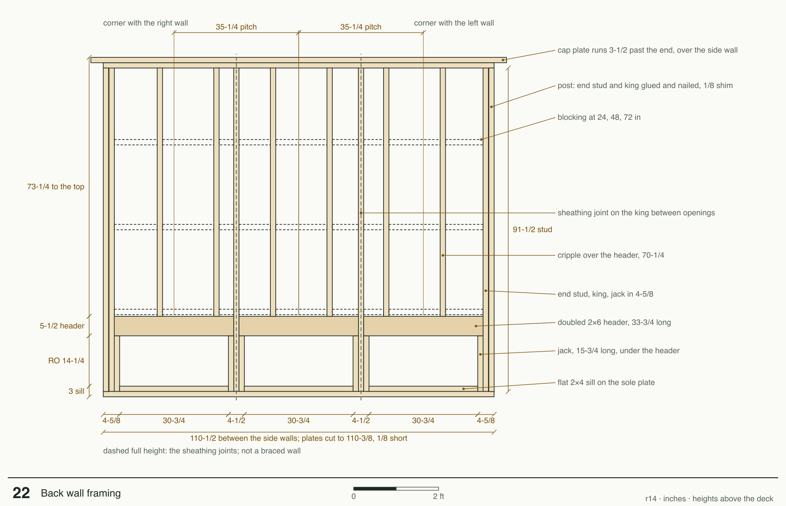

Back wall framed flat on the deck, seen from outside, the south-east wall. Plates cut to 110-3/8, 1/8 short of the 110-1/2 between the side walls' studs, so the wall drops in. Studs 91-1/2 at 16 in from the left end, sole plate and top plate, and a cap plate running 3-1/2 past each end to lap the side walls' top plates. Three module openings, RO 30-3/4 × 14-1/4, centred on the wall at 35-1/4 in, sill 3 on a flat 2×4, a jack and a king each side under a doubled 2×6 header, cripples 70-1/4 long over it at the layout. At each end the wall's end stud, the outer module's king and its jack fit in the 4-5/8 from the side wall's stud face to the RO; the end stud and king are glued and nailed as one post with 1/8 of shim, and the post nails through to the side wall's corner. The wall has no full-height panel, so it is not a braced wall: the front and side walls brace the hut through the roof. Sheathing joints land on the kings between the openings. Blocking rows at 24, 48, 72 in. Test every opening with the cartridge gauge before sheathing.

## 23. Front wall framing

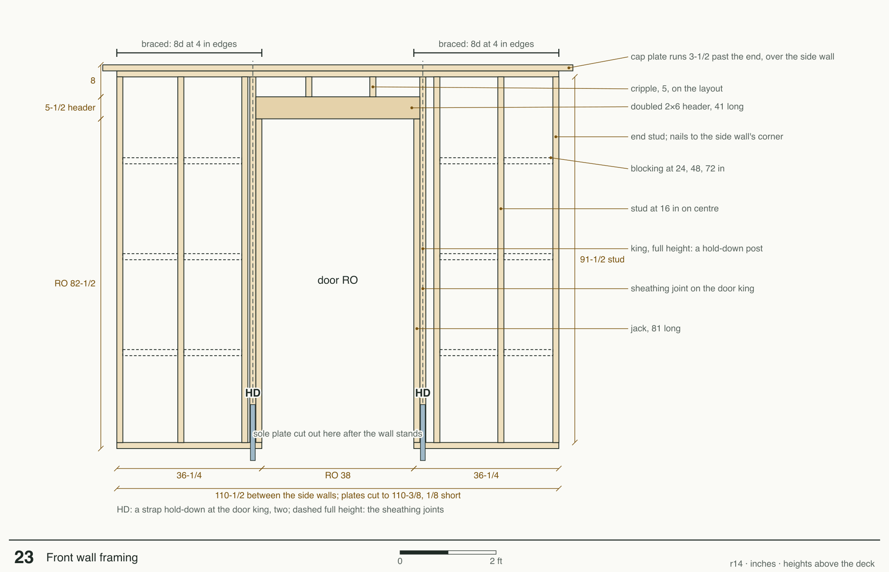

Front wall framed flat on the deck, seen from outside, the door wall, north-west. Plates cut to 110-3/8, 1/8 short of the 110-1/2 between the side walls' studs; studs 91-1/2 at 16 in, a top plate and a cap plate running 3-1/2 past each end over the side walls. The door RO, 38 × 82-1/2 centred, cuts the sole plate out between the jacks; a jack and a king each side under a doubled 2×6 header, two cripples 5 long over it to the plate. No window: the cupola is the glazing. The pre-hung door takes 1 a side in the RO and a 2 head. The panels either side of the door, 36-1/4 and 36-1/4 long, are braced walls: sheathing nailed 8d at 4 in on its edges and 12 in in the field, its joints on the door kings, and a strap hold-down at each door king. Blocking rows at 24, 48, 72 in, the same as the hive walls, so the T&G change runs round the room.

## 24. Roof framing plan

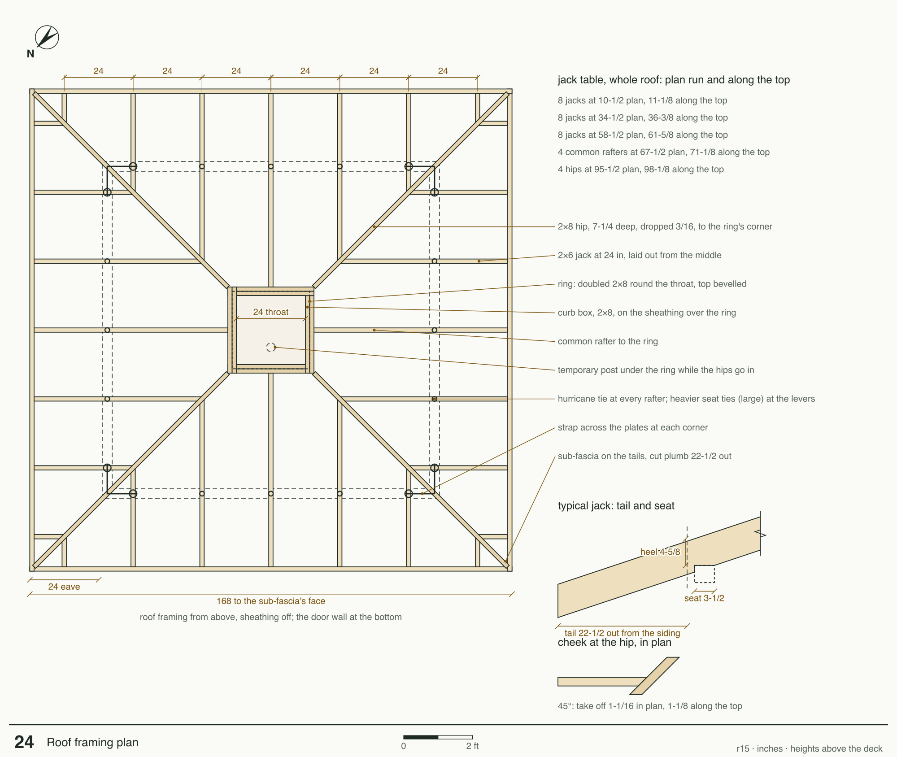

The roof from above with the sheathing off. Four 2×8 hips (7-1/4 deep) run from the tail corners to the corners of a doubled 2×8 ring round the 24 in throat, its top bevelled to the pitch so the sheathing runs over it to the throat; the curb box of 2×8 stands on the sheathing over the ring. 2×6 jack rafters at 24 in on centre are laid out from the middle of each wall, so the four faces are the same and the middle one is a common rafter to the ring. Every rafter sits on the double top plate with a seat cut 3-1/2 long and 4-5/8 of rafter left above the plate's outer edge; its tail is cut plumb 22-1/2 out from the siding, where the sub-fascia goes on, so the eave is 24 to the sub-fascia's face. Lengths in the table run along the top edge from the tail to the hip's centreline; take off half the hip's thickness measured on the 45 (1-1/8 along the top) at the cheek cut. The hips are dropped 3/16 so the jacks' top edges meet theirs. A skewed hanger at every jack's hip end; the eight short jacks in the eave corners hang from the hips alone. The eight jacks nearest the corners that land on the plate have more tail past it than backspan to the hip, so they are levers and get heavier seat ties. A hurricane tie at every rafter and hip over the plate, a strap across the plates at each corner, and a hold-down at each hip foot: a pyramid has no ceiling ties and the plates are its tension ring. While the hips go in, a temporary post with a cradle holds the ring at height from the deck.

## 25. Module fabrication

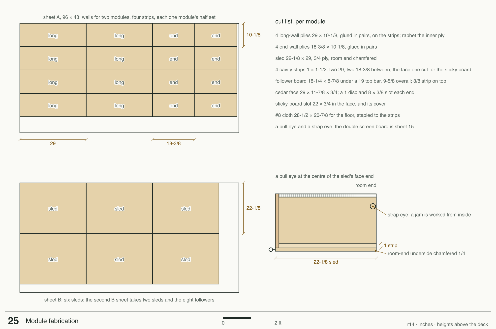

Cutting the modules. Box walls are two plies of 3/4 ply glued to 1-1/2, standing on the 1 in cavity strips: per module four long-wall plies 29 × 10-1/8 and four end-wall plies 18-3/8 × 10-1/8, so sled, strips, walls and board make the 12-5/8 that passes through the wall; the long walls, face side and room side, get the 3/8 × 3/4 rabbet in the inner ply after gluing, where the frame ears hang. One sheet walls two modules, four strips of 10-1/8 each carrying one module's half set. The sled is one 3/4 ply piece 22-1/8 × 29, six to a sheet, its room-end underside chamfered 1/4 as the lead-in to the sleeve. Followers 18-1/4 wide and 9-5/8 tall with their 19 top bar, felted at the edges to be bee-tight, a 3/8 strip on top to meet the lower screen. Eight modules take four sheets of walls, two of sleds and followers and one spare: seven. The cedar face (29 × 11-7/8), the 1 in cavity strips, a stainless pull eye at the centre of the sled's face end, away from both entrances, and a strap eye on the room end complete the box.

## 26. Cartridge fabrication

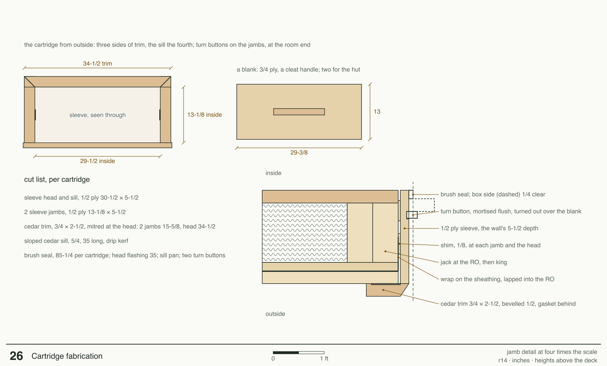

Making the hatch cartridges, eight of them, and the two blanks. The sleeve is 1/2 in ply the depth of the wall: head and sill 30-1/2 × 5-1/2, jambs 13-1/8 × 5-1/2 between them, glued and nailed square on the gauge module with 1/4 all round, 30-1/2 × 14-1/8 outside. It goes into its 30-3/4 × 14-1/4 RO on shims, 1/8 at each jamb and at the head, over a sill pan. The cedar trim runs on three sides only, 3/4 thick and 2-1/2 wide from the sleeve's inside, so it covers the sleeve and the shim gap and laps the siding; its inner edge is bevelled 1/2 so the sled finds the sleeve, and a foam gasket goes behind it. The frame is 34-1/2 outside. The fourth side is the sloped cedar sill (sheet 17), 35 long so neighbours stay apart, its back at the rail tops and falling 1:12 with a drip kerf. The wrap is on the sheathing's face, lapped into the RO over the jacks before the sleeve goes in; a head flashing goes over the trim, under the wrap above. Brush seals line the sleeve's room end. Each blank is 3/4 ply 29-3/8 × 13, the sleeve's inside less 1/8, with a cleat handle; it stands in against the seals from outside, held by two turn buttons mortised flush into the sleeve's jambs at the room end: turned out over the blank's edges they hold it, turned back they leave the box its 1/4 clearance.

## 27. Intake cartridge

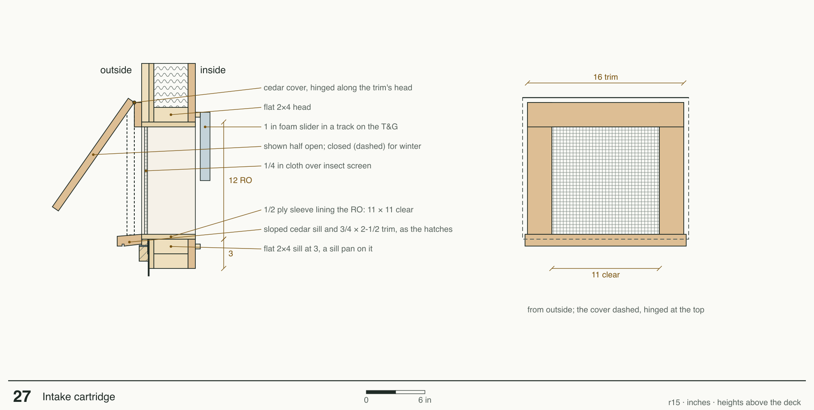

The two intakes, low in the side walls under the quiet bays. A 1/2 in ply sleeve lines the 12 × 12 RO, which sits on a flat 2×4 at 3 and under a flat 2×4 head, between the front module's king and one stud (sheet 21). At the outer end, 1/4 in hardware cloth over insect screen, a sill pan under the sleeve; round it the same cedar trim as the hatches, 3/4 × 2-1/2 on three sides, and the same sloped sill, 16-1/2 long, clear of the water table at the wall's foot. A cedar cover hinged along the trim's head sheds rain half open and closes flat for winter. Inside, a 1 in foam slider runs in a track on the T&G and sets the opening from shut to full; the operating rules set it for sessions and for winter.

## 28. Corners, hold-downs and anchors

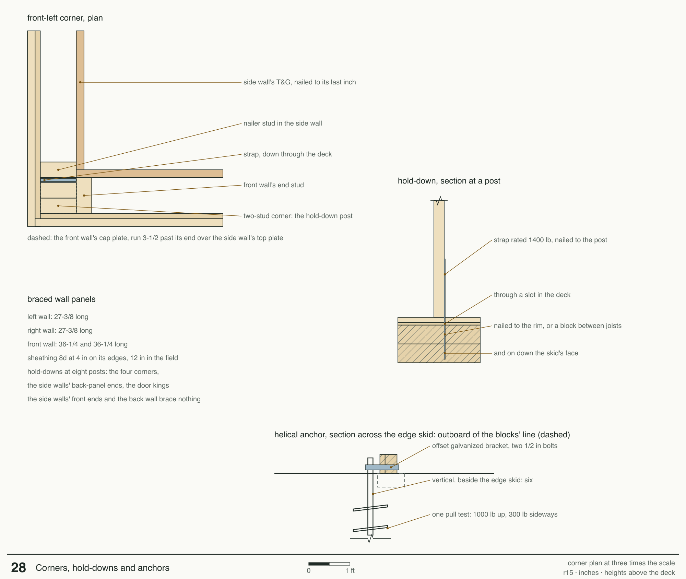

How the hut is held together and held down. The front-left corner in plan, at three times the scale: the side wall runs through with a two-stud corner, the front wall's end stud stands inside it, and a nailer stud in the side wall catches the side wall's T&G where it meets the front wall's; the front wall's cap plate runs 3-1/2 past its end over the side wall's top plate, so the plates, the pyramid's tension ring, lap at every corner. The hut is braced as three walls working through the roof, every wall sheathed above and below its openings (continuous sheathing): each side wall's back corner panel and the front wall either side of the door, nailed 8d at 4 in on the edges and 12 in in the field, with a strap hold-down rated 1400 lb at each of the eight posts marked HD on sheet 21 and sheet 23. Each strap runs down the post, through a slot in the deck, and wraps the rim or the block under it: at the corners on down the skid's face, at the door kings round the front rim's three plies. The side walls' front ends, cut by the intakes, and the back wall, all openings, brace nothing. The hut stands on six helical anchors driven vertically beside the edge skids, 4-1/4 out from each skid's face so they clear its blocks, 6 in from each end and one at the middle between two joists: driven on the layout in October before the blocks go in, then each bracketed with an offset bracket and through-bolted to its skid (and the outrigger where it laps), and one of them pull-tested to 1000 lb uplift and 300 lb sideways in this soil. Three braced walls working through the roof is not the IRC's prescriptive bracing, so whatever the county's classification, an engineer checks the wind and anchorage on one page.

## 29. Weather details

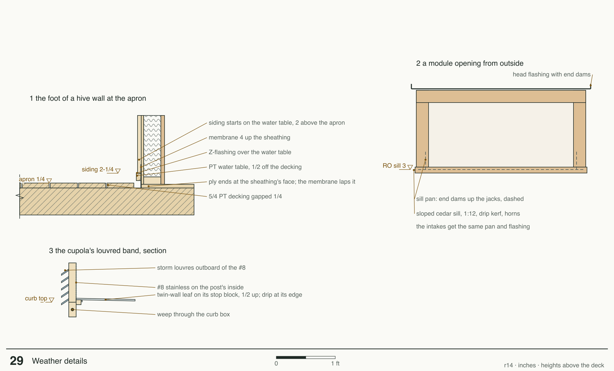

Where water meets the building. The foot of a hive wall at the apron: the apron is 1 in PT decking gapped 1/4, standing 1/4 above the deck inside and stopping short of the wall; a self-adhered membrane laps from the joist under the decking over the ply's edge and 4 in up the sheathing; a PT water table stands 1/2 off the decking under a Z-flashing, and the sawmill siding starts on it, 2 above the apron (the code wants two). At every module opening, a sill pan: membrane on the flat 2×4 sill, a back dam at the room side, end dams turned up the jacks, and its outer leg over the sheathing below, lapped by the wrap; the sloped cedar sill falls 1:12 over it with a drip kerf, its back at the rail tops. Over every trim head, a Z-flashing tucked under the wrap above, with end dams. The intakes get the same pan and flashing. At the cupola, drainable storm louvres stand outboard of the #8 so driven rain drops before it reaches the screen; the twin-wall damper leaf drips at its free edge onto a stop, and weep holes in the curb box let anything that gets past drain out over the flashing. Sections are through the wall; the opening is seen from outside. The opening's section, with its pan, sill and head flashing, is on sheet 17, and the intake's on sheet 27. Heights are above the deck inside; the cupola's are from its curb top.

## 30. Drainage and low voltage

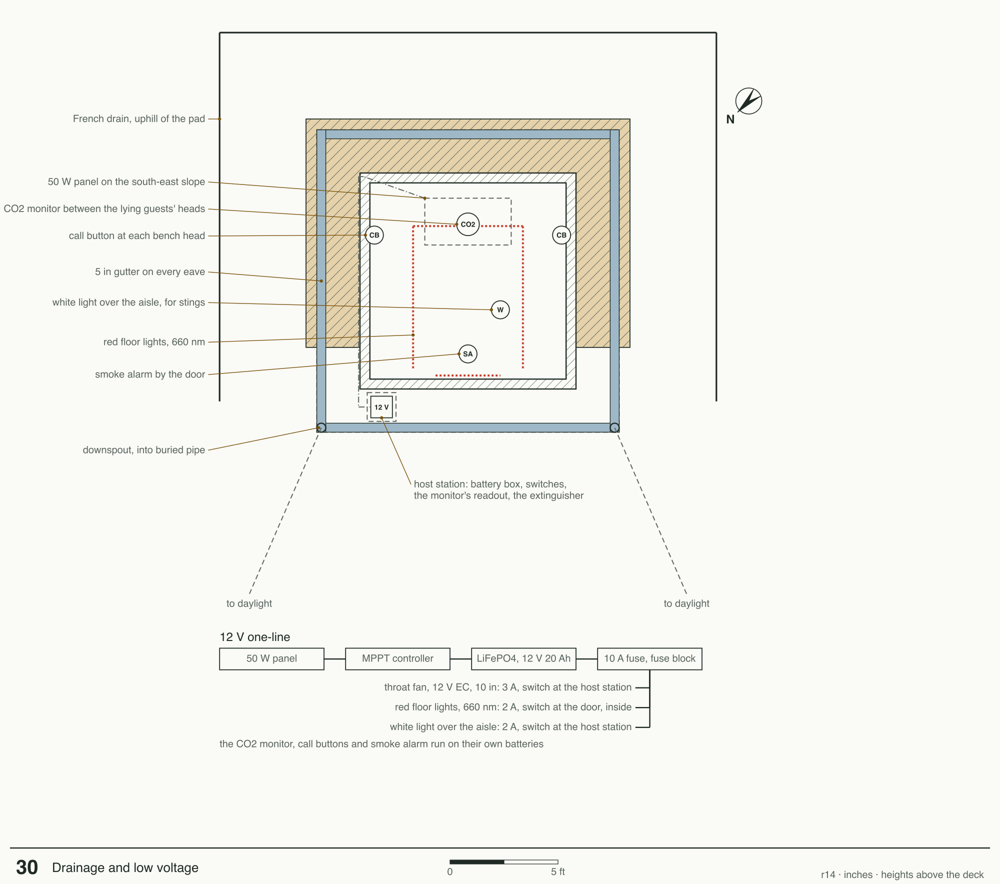

Water off the roof and power to the room. A 5 in gutter on every eave; downspouts at the two front corners, into buried pipe that runs out to daylight ahead of the building, away from the flight zones behind and beside it. A French drain across the uphill side beyond the stone apron keeps runoff off the pad. The 12 V system is small and outside the room: a 50 W panel on the south-east slope, and an MPPT charge controller, a 20 Ah LiFePO4 battery that won't charge below 32 °F, a 10 A fuse and a fuse block in a vented box on the host station, off the landing's hinge side; the cable from the panel in conduit down the back-left corner and along the left edge skid's face. A busy day uses about 31 Wh, the panel gives about 112 on a shoulder-season day. From the fuse block, three circuits: the throat fan (12 V EC, 10 in, about 150 cfm, switched at the host station), the red floor lights (660 nm strip along the bench fronts' toes and across the door, switched at the door inside, on for every session from an hour before sunset and for every exit), and a white light over the aisle switched at the host station for stings. The CO2 monitor on the back bench's front rail, at head height between the lying guests, runs on its own battery with its readout at the host station; the call buttons at the head of each side bench are wireless, with the old bell kept as the end chime. A photoelectric smoke alarm on the ceiling by the door, a 2-A:10-B:C extinguisher at the host station.

## 31. Entrance

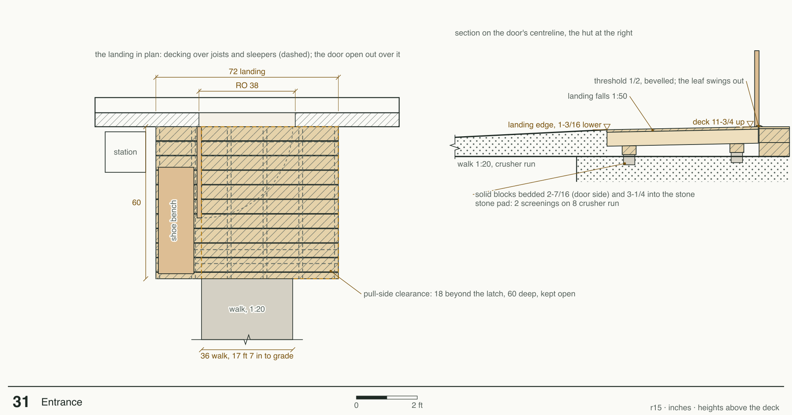

The way in. A 36 in leaf in a 38 in RO swings out, so a guest who faints can't block it and the room keeps its floor; it gives 33-3/4 clear. Lever handle, no lock on the inside, a luminous lever, a door viewer, a closer, and a threshold no taller than 1/2, bevelled. Outside, a 72 × 60 landing is level with the deck at the door and falls 1:50 away from it: two PT 4×6 sleepers laid flat on solid blocks, bedded 2-7/16 and 3-1/4 into the stone so the decking meets the deck, 6 PT 2×6 joists at 16 in or less, 5/4 decking gapped 1/4, set clear of the hut so each moves on its own. The door hangs on the left jamb as you face it from the landing, so it opens to the left. The shoe bench stands on the landing along its left edge, clear of the leaf, and the host station on the stone just off that edge, against the wall: the battery box, the switches, the monitor's readout and the extinguisher. Nothing stands in the pull-side clearance, 60 in deep and 18 in beyond the latch. From the landing's edge a 36 in walk runs down to grade at 1:20, 17 ft 7 in of compacted stone fines on crusher run between PT 2×8 edges: no step and no rail, since a walk that gentle is not a ramp.

## 32. Bench frame

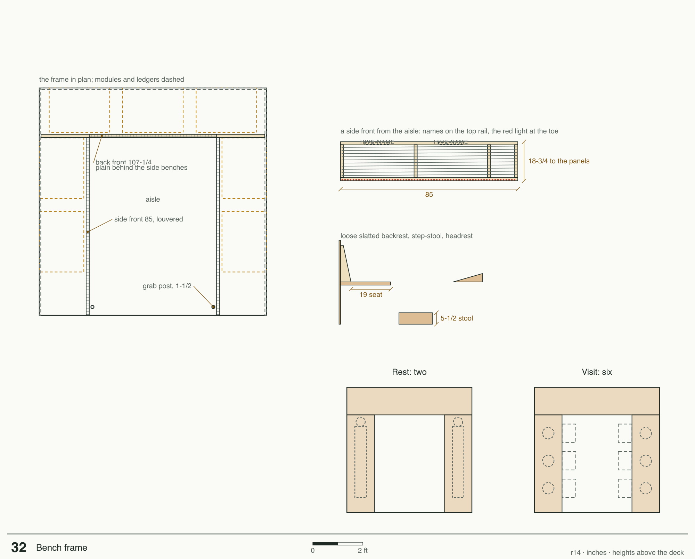

The benches' frame and what goes on them. Three louvered 2×4 fronts carry the panels' front edges: the back one 107-1/4 long between the side walls' ledgers, set 1/4 behind the rear side boxes so nothing touches them, louvered along the aisle and plain behind the side benches' ends; the side ones 85 long, butting its face. Each front's top rail carries the hive names over its modules, and a red floor light runs along its toe. Two formats: Rest, two guests at most, one lying on each side bench with the head at the back wall end, a headrest under it; Visit, up to six, three sitting on each side bench facing across the aisle, 24 in each, with a loose slatted backrest, leaning back 13°, that brings the seat to 19 deep and a 5-1/2 in step-stool under the feet, since the 20-1/4 in top is above many people's knees. Nobody sits on the back bench. Every panel is proven to 250 lb at any point. A 1-1/2 in grab post at each side bench's door end, for standing up after an hour lying warm.

## 33. Side and door walls from inside

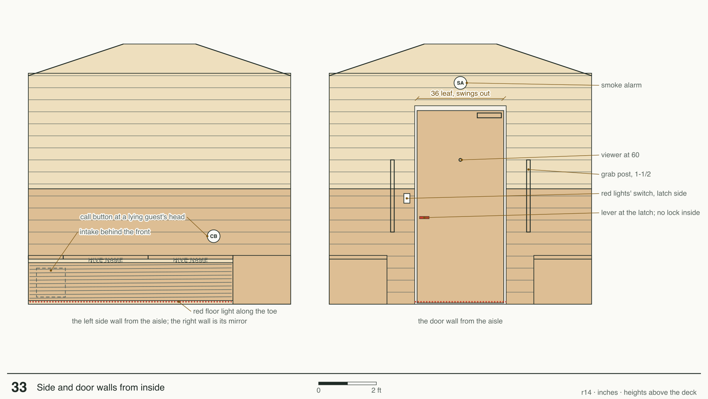

The left side wall and the door wall, from the aisle. The side wall: cedar T&G to 48 in, pine above; the side bench's louvered front with the hive names on its top rail over the two modules and a red floor light along its toe; the quiet bay panel over the intake, which sits behind the front (dashed) with its foam slider; a wireless call button on the wall at a lying guest's head, at the back end; the ceiling rising on the hips toward the ring. The right wall is its mirror. The door wall: the 36 in door swinging out, hinged at the right as you face it from inside (the left jamb seen from the landing), its lever luminous, a viewer at 60 in to check the landing before opening, a closer; the red floor light across the door and its switch at 42 in on the latch side, inside; the side benches' ends, each with a 1-1/2 in grab post; a photoelectric smoke alarm on the ceiling by the door. No lock on the inside, and nothing a guest could lock.

## 34. Control board

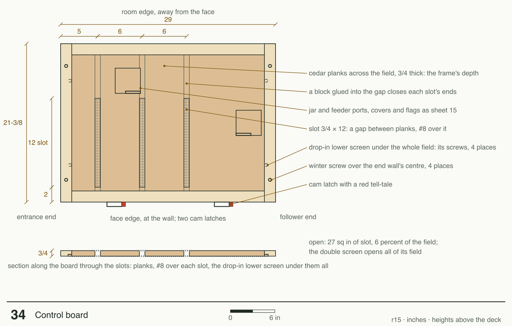

The year-one control, on the left front module: Sharashkin's slotted planks in place of the double screen, so one colony shows what the double screen costs or saves. It is the double screen board of sheet 15 in every way but its field: the same 29 × 21-3/8 1×2 frame, the drop-in lower screen screwed up flush under the whole field, both ports in the same places under the same captive covers and flags, the two cam latches with their tell-tales, and the four winter screws. The field is cedar planks across the board, 3/4 thick, the frame's depth, their ends rabbeted 1/4 × 1/2 underneath to clear the drop-in frame. Three 3/4 × 12 slots are the gaps between planks, closed to length by blocks glued in at their ends, 6 in apart from 5 in off the entrance end and 2 in off the face edge, clear of both covers' travel; #8 is stapled over each slot on top, and the lower screen closes them all below. The slots are 6 percent of the field, about what Sharashkin's slotted planks open, where the double screen opens all of it through two layers of #8. Each month both lower screens are photographed against a lamp; at the season's end the two are compared for propolis and the two colonies for strength, and that decides whether the double screen stays.

## 35. Seating kit and panel lock

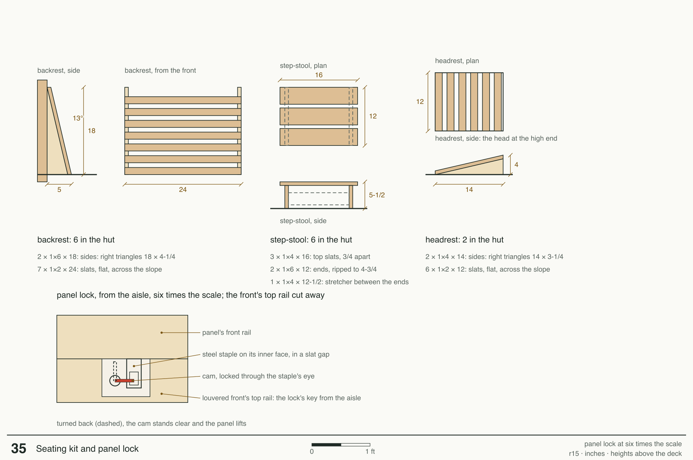

What goes on the benches, all clear cedar, each piece cut from the list under it. The backrest, one per sitter at a Visit: two right-triangle sides 18 tall and 4-1/4 deep, seven 1×2 slats on the flat across the slope, 1 apart; it stands on the bench against the wall, leans back 13°, and leaves a 19 in seat. The step-stool, one per sitter: three 1×4 slats on two 1×6 ends and a stretcher, 5-1/2 tall, under the feet of anyone whose knees are lower than the bench. The headrest, one per lying guest at a Rest: a wedge 14 long rising to 4 at the head, slatted the same way, in a washable cover. Screw and glue everything, round every edge, and oil nothing that a guest's skin touches. The panel lock holds each module panel down on session days: a steel staple screwed to the inner face of the panel's front rail, in a gap between slats, hangs into a mortise in the louvered front's top rail, and a keyed cam lock through that rail, its key from the aisle, turns its cam a quarter through the staple's eye. Turned back, the cam stands clear and the panel lifts; the one key hangs at the host station (sheet 36).

## 36. Host station

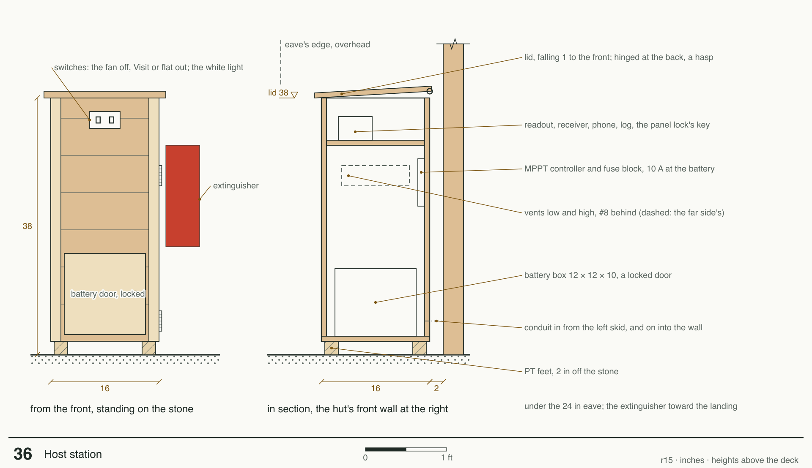

Where the host stands during a session, on the stone just off the landing's hinge side, its back 2 in off the siding and the whole of it under the 24 in eave (sheet 31). A cedar cabinet 16 square and 38 tall to its lid: 2×2 corner posts on PT feet 2 in off the stone, 1×6 boards on its sides and back, and a lid that falls 1 to the front, hinged at the back, with a hasp. Under the lid, a shelf for the CO2 monitor's readout, the call buttons' receiver, the phone, the log and the panel lock's key on its hook. On the front under the lid, the switches: the throat fan (off, Visit, flat out) and the white light. On the back inside, the MPPT controller and the fuse block, the 10 A fuse at the battery. On the floor, the battery box, 12 × 12 × 10, behind a locked door, the cabinet vented low and high through #8 on both sides. The extinguisher hangs on the side toward the landing. The panel's cable comes in at the back from the conduit along the left skid; the room's circuits leave the same way, in conduit into the wall (sheet 30).
